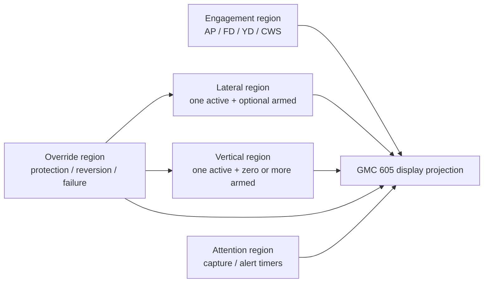
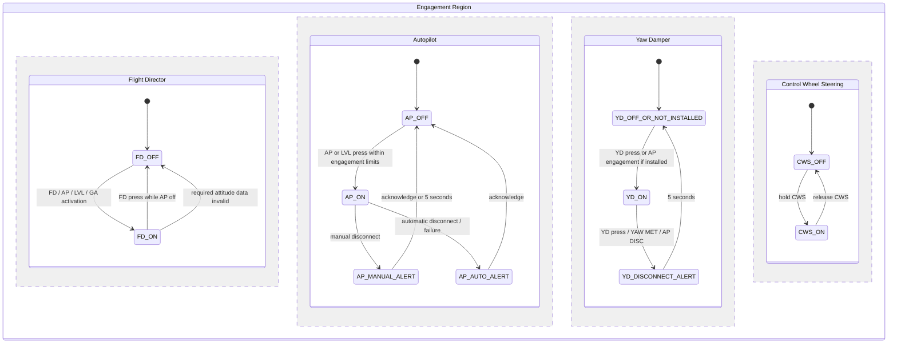
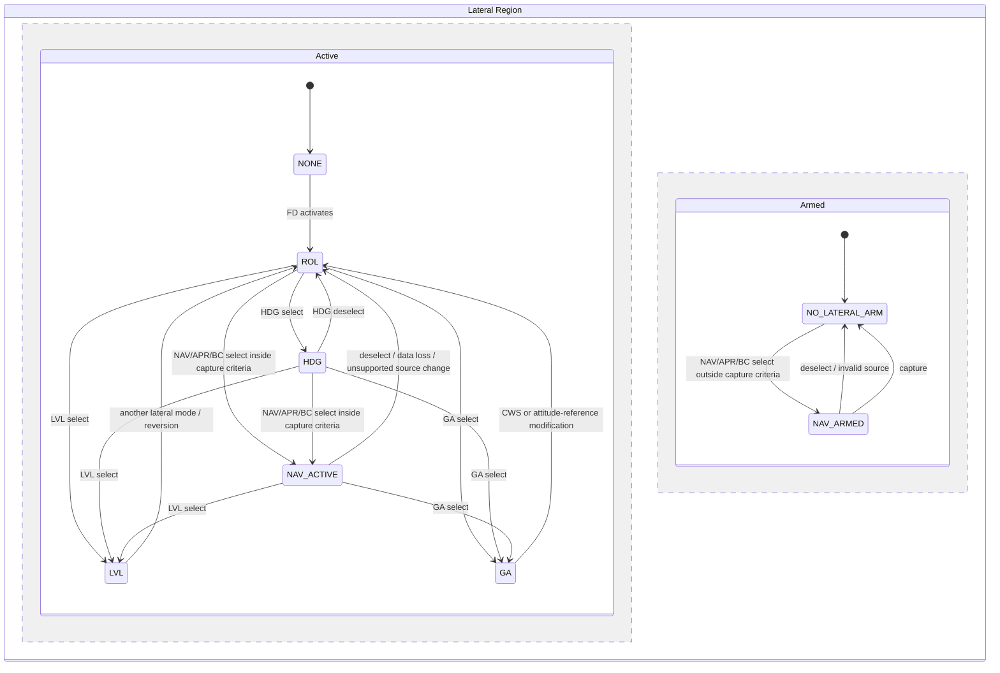
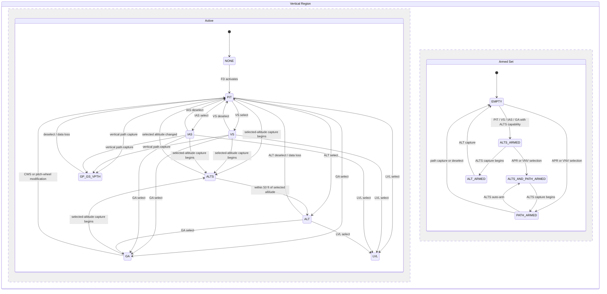
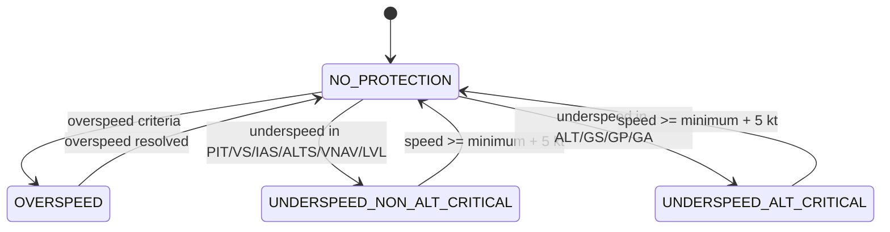
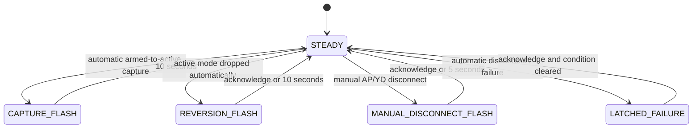

# GFC 600 Logic Reference

## Purpose

Define the canonical GFC 600-style state the connector should produce. This is
the behavior target, not an autopilot implementation.

## Sources And Interpretation

Confirmed GFC 600 behavior is based on Garmin's `GFC 600 Pilot's Guide`,
`190-01488-00 Rev. H`, especially:

- Section 1.4, AFCS controls.
- Section 1.5, system indications.
- Section 2.1, AFCS operation and Flight Director modes.
- Sections 2.2 through 2.5, engagement, protection, vertical modes, VNAV, and
  lateral modes.
- Section 3.1, visual annunciations and alerts.

The diagrams below normalize those behaviors for an MSFS connector. They do not
claim to reproduce Garmin's internal certified software design.

## Core Rules

- The Flight Director has one active lateral mode and one active vertical mode.
- Lateral and vertical modes are normally independent.
- Default modes are `ROL` lateral and `PIT` vertical.
- Armed modes wait for capture criteria while the current active mode remains.
- Automatic armed-to-active capture flashes the new active mode for 10 seconds.
- Loss of required data reverts the affected axis to `ROL` or `PIT` and produces
  an FD/reversion alert.
- `LVL` and `GA` are coupled lateral and vertical modes.
- AP follows the active Flight Director modes. AP engagement is separate from
  mode selection.

## State-Machine Structure

The GFC 600 cannot be modeled correctly as one flat list of modes. It is a
hierarchical state machine with parallel regions:



The complete canonical state is the product of these regions:

```text
engagement
  x lateral active
  x lateral armed
  x vertical active
  x vertical armed set
  x override state
  x attention state
```

For example, this is one valid state:

```text
AP engaged
FD on
lateral active HDG
lateral armed GPS
vertical active VS
vertical armed ALTS + GP
no protection override
no attention flash
```

## Canonical State

```text
Engagement:
  AP state, FD state, YD state, CWS active

Lateral:
  one active mode
  zero or one armed mode

Vertical:
  one active mode
  zero or more armed modes

Display:
  active/armed labels, relevant reference, messages, LED intent

Transition:
  reason and attention timing
```

### State Invariants

- When FD is off, lateral and vertical active modes are `NONE`.
- When FD is on, both axes normally have an active mode.
- An armed mode does not replace the current active mode until capture.
- A mode cannot be active and armed on the same axis simultaneously.
- Coupled modes `LVL` and `GA` change both axes as one logical transition.
- Protection may temporarily move previous active modes into armed state.
- Attention state describes how a transition is annunciated; it is not itself an
  active Flight Director mode.

### Canonical Lateral Modes

| Mode | Meaning |
|---|---|
| `NONE` | FD lateral guidance unavailable/off. |
| `ROL` | Default roll hold; reversionary ROL commands wings level. |
| `HDG` | Tracks selected heading. |
| `GPS` | GPS navigation or GPS approach lateral tracking. |
| `VOR` | VOR navigation tracking. |
| `LOC` | Localizer navigation or approach tracking. |
| `VAPP` | VOR approach mode. |
| `BC` | Localizer backcourse tracking. |
| `LVL` | Coupled level mode. |
| `GA` | Coupled go-around mode. |

### Canonical Vertical Modes

| Mode | Meaning |
|---|---|
| `NONE` | FD vertical guidance unavailable/off. |
| `PIT` | Default pitch hold. |
| `ALT` | Altitude hold. |
| `ALTS` | Selected-altitude capture transition. |
| `VS` | Vertical speed hold. |
| `IAS` | Indicated airspeed hold. |
| `GP` | GPS glidepath capture/tracking. |
| `GS` | ILS glideslope capture/tracking. |
| `VPTH` | VNAV vertical-path tracking. |
| `ALTV` | VNAV constraint-altitude capture. |
| `LVL` | Coupled level mode. |
| `GA` | Coupled go-around mode. |

`FLC` is not a documented GMC 605 annunciation in the GFC 600 Pilot's Guide.
An aircraft adapter may map an MSFS FLC mode to canonical `IAS` only when that
aircraft uses FLC as the equivalent speed-on-pitch mode.

## Engagement State Machine

Engagement is separate from lateral and vertical guidance. AP follows the Flight
Director; it does not replace the Flight Director mode state.



Textual behavior:

- FD activation initializes the axes to `ROL` and `PIT`.
- AP engagement with FD already on preserves the existing FD modes.
- AP engagement with FD off activates FD and its default modes.
- The FD key is disabled while AP is engaged.
- AP engagement also engages YD when YD is installed.
- Manual AP disconnect creates a five-second yellow attention state.
- Automatic AP disconnect creates a red attention state that remains until
  acknowledged.
- YD has its own engagement state and can remain engaged after some AP
  disconnect methods; the adapter must not infer YD solely from AP state.
- CWS temporarily releases pitch and roll servos without changing AP engagement;
  its reference effects depend on the active modes.

## Lateral State Machine

The lateral region contains an active sub-state and an armed sub-state that run
in parallel. Selecting a capture-capable mode outside capture criteria changes
only the armed sub-state; the current active mode continues.



`NAV_ACTIVE` and `NAV_ARMED` carry one of the source-specific canonical labels:
`GPS`, `VOR`, `LOC`, `VAPP`, or `BC`.

The arrows show the principal documented transitions. Selecting a compatible
lateral mode may replace other active lateral modes even where a direct arrow is
not drawn.

Textual behavior:

1. FD activation establishes `ROL` unless a coupled mode establishes both axes.
2. HDG selection immediately replaces the current active lateral mode.
3. NAV, APR, and BC use CDI/capture criteria:
   - Outside capture criteria: requested mode becomes armed.
   - Inside capture criteria: requested mode becomes active immediately.
4. When an armed lateral mode captures, it replaces the current active lateral
   mode and receives 10-second capture attention.
5. Active navigation-data loss or an unsupported source change reverts lateral
   guidance to wings-level `ROL`.
6. DG-only installations cannot arm NAV/APR/BC and require immediate capture.

## Vertical State Machine

The vertical region also has active and armed sub-states in parallel. Multiple
vertical modes may be armed together.



`GP_GS_VPTH` represents the source-specific active path mode `GP`, `GS`, or
`VPTH`. `PATH_ARMED` may contain `GP`, `GS`, `VPTH`, or `ALTV`.

The arrows show the principal capture paths, not every installation-specific
combination from which GP, GS, VPTH, or altitude capture may occur.

Textual behavior:

- Selecting PIT, VS, IAS, or GA automatically arms `ALTS` when that installation
  supports selected-altitude capture.
- ALT selection captures the current altitude directly; it is distinct from the
  automatic `ALTS` sequence.
- `ALTS` is a real transitional active mode, not merely an armed flag.
- During active `ALTS`, `ALT` becomes armed. At 50 feet from selected altitude,
  `ALT` captures and receives 10-second attention.
- `GP` requires GPS lateral active and valid glidepath capture conditions.
- `GS` can capture only after `LOC` is active.
- `VPTH` captures at top of descent; `ALTV` manages VNAV constraint-altitude
  capture when supported.

## Protection Override State Machine

Protection temporarily overrides guidance while preserving modes for restoration.
It is not a normal pilot-selected vertical mode transition.



Entry and exit actions:

| Override | Entry action | Exit action |
|---|---|---|
| Overspeed | Move previous active vertical mode to armed; activate `IAS`; show `MAXSPEED`. | Restore previous vertical mode; remove message. |
| Non-altitude-critical underspeed | Move previous active vertical mode to armed; activate `IAS`; show `MINSPEED`. | Restore previous vertical mode; remove message. |
| Altitude-critical underspeed | Move previous active lateral and vertical modes to armed; activate `ROL` + `IAS`; show `MINSPEED`. | Restore previous lateral and vertical modes; remove message. |

Protection availability and exact behavior remain installation-dependent.

## Attention State Machine

Attention state explains how a transition is displayed. It must be carried with
the transition because final mode labels alone do not reveal why they changed.



## Important Transitions

### Engagement

| Input/event | Result |
|---|---|
| FD selected while off | FD on with `ROL` + `PIT`. |
| AP selected while FD off | AP and FD on with `ROL` + `PIT`; YD engages if installed. |
| AP selected while FD already on | AP follows existing FD modes. |
| Manual AP disconnect | AP off; yellow disconnect alert for five seconds. |
| Automatic AP disconnect/failure | AP off; red alert until acknowledged. |
| LVL selected | AP engages if needed; all modes clear; `LVL` active on both axes. |

### NAV, APR, And BC

For supported HSI installations:

```text
selected with CDI > half scale -> requested mode armed
selected with CDI < half scale -> requested mode active immediately
armed mode reaches capture criteria -> moves active and flashes 10 seconds
```

Approach coupling:

| APR source | Lateral | Vertical armed |
|---|---|---|
| GPS | `GPS` | `GP` |
| VOR | `VAPP` | None |
| LOC | `LOC` | `GS` |

`GS` can capture only after `LOC` is active. `GP` requires GPS lateral active
plus valid glidepath capture conditions.

### Selected Altitude Capture

```text
PIT / VS / IAS / GA active -> ALTS armed when supported

approaching selected altitude:
  ALTS becomes active and flashes
  ALT becomes armed

within 50 ft:
  ALT becomes active and flashes

selected altitude changed while ALTS active:
  revert to PIT
  arm ALTS for the new target
```

### Reversion

| Lost requirement | Result |
|---|---|
| Active lateral mode data lost | Lateral reverts to `ROL`. |
| Active vertical mode data lost | Vertical reverts to `PIT`. |
| Required attitude data lost | FD disables. |
| Active NAV/APR source or supported frequency changes | Normally reverts to `ROL`, unless installation-specific autoswitching applies. |

### Protection Overrides

Protection is a temporary override that preserves prior modes as armed.

| Condition | Active replacement | Preserved armed state | Message |
|---|---|---|---|
| Overspeed | Vertical `IAS` | Previous vertical mode | `MAXSPEED` |
| Altitude-critical underspeed | Lateral `ROL` + vertical `IAS` | Previous lateral and vertical modes | `MINSPEED` |
| Other underspeed | Vertical `IAS` | Previous vertical mode | `MINSPEED` |

When protection clears, the preserved prior mode becomes active again.

## Annunciation Rules

| Event | GMC 605-style display intent |
|---|---|
| Active mode | Large upper text. |
| Armed mode | Smaller lower text. |
| Automatic capture | New active mode flashes inverse for 10 seconds. |
| Mode reversion/data loss | Affected mode and FD attention flash up to 10 seconds. |
| Manual AP disconnect | AP LED yellow flash for five seconds. |
| Automatic AP disconnect/failure | AP LED red flash until acknowledged. |
| YD disconnect | YD LED yellow flash for five seconds. |
| CWS active | `CWS ON`; AP LED flashes green. |
| Unsupported key | `DISABLD KEY`. |

## Installation-Dependent Features

These must be declared by each aircraft adapter:

- `ALTS`, `VPTH`, and `ALTV` availability.
- GP/GS and approach autoswitching.
- HSI versus DG behavior.
- YD and trim availability.
- Protection behavior.
- Failure, CWS, and GFC-specific messages.

## Connector Normalization Rules

These are project rules, not claims about Garmin internal implementation:

1. Preserve raw MSFS observations before mapping them.
2. Produce one atomic canonical update when a coupled mode changes both axes.
3. Store active and armed modes separately.
4. Store multiple vertical armed modes as an ordered set.
5. Emit a transition reason: pilot select, pilot deselect, capture, reversion,
   protection entry, protection exit, failure, or synchronization.
6. Emit attention intent and expiry explicitly.
7. Mark uncertain state as unknown instead of forcing a default label.
