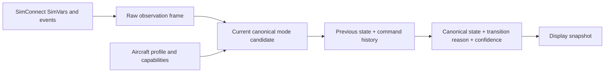
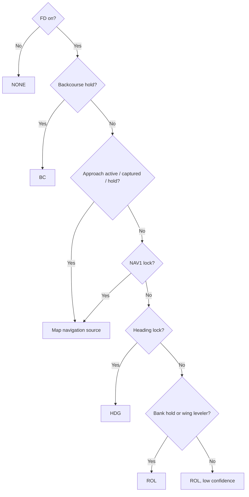
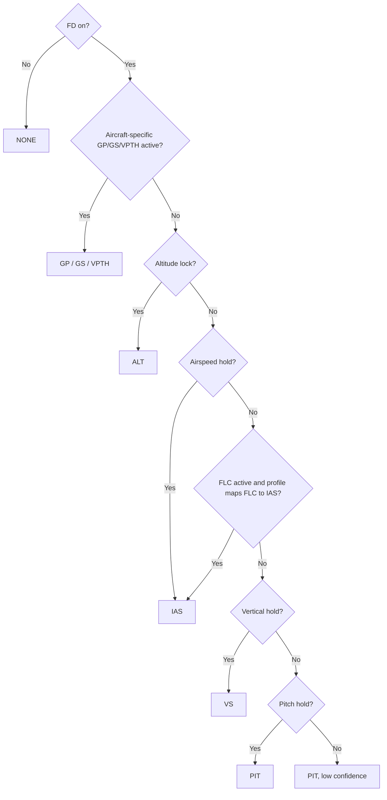

# MSFS SimVars To Canonical GFC 600 Modes

## Purpose

Define the first practical generic-MSFS mapping used by the Python connector.
This table separates reliable mappings from aircraft-dependent approximations.

## Mapping Pipeline

The connector should not map individual SimVars directly into display labels.
It should process a complete timestamped observation frame:



The raw frame must be retained for diagnostics and trace replay. Mapping only the
latest boolean values loses the evidence needed to distinguish selection, capture,
reversion, and protection.

## Raw Observation Rules

Every raw SimVar must use tri-state validity:

```text
AVAILABLE_TRUE
AVAILABLE_FALSE
UNAVAILABLE
```

`UNAVAILABLE` must never be converted to false. A temporary SimConnect read
failure otherwise appears as AP disconnect, dropped mode, or data-loss reversion.

Each raw frame should contain:

```text
monotonic timestamp
simulator/aircraft/profile identity
connection generation
value + validity for every requested SimVar
recent system events
```

On connector startup, reconnect, or aircraft/profile change, the first complete
frame creates a `SYNC` transition. It must not generate capture, reversion, or
disconnect alerts.

## Confidence Meanings

| Confidence | Meaning |
|---|---|
| High | Generic SimVar directly represents the canonical state for native MSFS autopilots. |
| Medium | Useful mapping, but must be verified in the selected aircraft. |
| Low | Heuristic only; do not present as confirmed GFC behavior. |
| None | Generic SimVars cannot represent it; aircraft adapter required. |

## Engagement Mapping

| Canonical state | Generic MSFS evidence | Confidence | Notes |
|---|---|---|---|
| AP engaged | `AUTOPILOT MASTER != 0` | High | Final engagement state only. |
| FD on | `AUTOPILOT FLIGHT DIRECTOR ACTIVE != 0` | High | Connector may infer FD on while AP is on, but should mark it derived. |
| YD engaged | `AUTOPILOT YAW DAMPER != 0` | High | Installation availability still aircraft-dependent. |
| Manual AP disconnect alert | AP changed on-to-off immediately after connector sent a manual disconnect request | Medium | Requires command history and timing. |
| Automatic AP disconnect/failure | `AUTOPILOT DISENGAGED` plus no matching manual request | Low | Cause and failure state are not proven. |
| CWS active | No reliable generic mapping | None | Aircraft adapter required. |

### Engagement Interpretation Rules

- Treat SimVar booleans as true when non-zero.
- AP and FD are independent state dimensions even when the connector derives FD
  on from AP engagement.
- An AP on-to-off edge is not enough to classify manual versus automatic
  disconnect.
- Command history can support a manual-disconnect classification only within a
  short profile-defined confirmation window.

## Navigation Source Mapping

Evaluate in this order:

```text
GPS DRIVES NAV1 -> GPS
else HSI HAS LOCALIZER -> LOC
else valid CDI -> VOR
else UNKNOWN
```

This is a fallback heuristic. The selected aircraft may expose a better CDI
source variable or Input Event.

The generic source heuristic cannot prove:

- Whether a source is selected versus merely valid.
- Whether GPS mode is navigation or approach.
- Whether LOC mode is navigation or approach.
- Whether the installation supports CDI autoswitching.

## Lateral Active Mapping

Evaluate active modes in priority order:

| Priority | Canonical mode | Generic condition | Confidence |
|---:|---|---|---|
| 1 | `BC` | `AUTOPILOT BACKCOURSE HOLD` | High |
| 2 | `GPS`, `VAPP`, or `LOC` approach | Approach active/captured/hold plus mapped navigation source | Medium |
| 3 | `GPS`, `VOR`, or `LOC` navigation | `AUTOPILOT NAV1 LOCK` plus mapped navigation source | Medium |
| 4 | `HDG` | `AUTOPILOT HEADING LOCK` | High |
| 5 | `ROL` | `AUTOPILOT BANK HOLD` or `AUTOPILOT WING LEVELER` | Medium |
| 6 | `ROL` | FD on with no confirmed lateral mode | Low |
| 7 | `NONE` | FD off | High |

Important limitations:

- Generic approach SimVars do not reliably distinguish every aircraft's approach
  armed, captured, and active phases.
- `GPS` navigation and `GPS` approach use the same canonical lateral label; GP
  state distinguishes the approach when available.
- `LOC` navigation and `LOC` approach use the same lateral label; GS state
  distinguishes the approach when available.
- `LVL` and `GA` do not have reliable universal generic mappings.

### Lateral Mapping Decision Tree



## Lateral Armed Mapping

| Canonical armed mode | Generic evidence | Confidence |
|---|---|---|
| GPS/VAPP/LOC approach armed | `AUTOPILOT APPROACH ARM` plus mapped source, while approach is not active/captured | Medium |
| GPS/VOR/LOC NAV armed | No complete generic SimVar | None |
| BC armed | No complete generic SimVar | None |

The connector may derive NAV/BC armed state from command history plus CDI
position for a tested aircraft, but it must mark that state as derived.

Generic SimVars do not provide a universal NAV-arm or BC-arm boolean. Therefore,
the generic adapter must not apply the real GFC half-scale arming rule unless it
also knows:

- A NAV/APR/BC request was made.
- The selected source at the time of the request.
- The aircraft profile uses GFC-like half-scale capture behavior.
- The CDI value and scale are meaningful for that source.

## Vertical Active Mapping

Evaluate in priority order:

| Priority | Canonical mode | Generic condition | Confidence |
|---:|---|---|---|
| 1 | `GS` | Glideslope active/hold and LOC source | Medium |
| 2 | `GP` | Aircraft-specific glidepath active evidence | None generically |
| 3 | `ALT` | `AUTOPILOT ALTITUDE LOCK` | High |
| 4 | `IAS` | `AUTOPILOT AIRSPEED HOLD` | High |
| 5 | `IAS` | `AUTOPILOT FLIGHT LEVEL CHANGE`, only when profile declares FLC equivalent to GFC IAS | Medium |
| 6 | `VS` | `AUTOPILOT VERTICAL HOLD` | High |
| 7 | `PIT` | `AUTOPILOT PITCH HOLD`, or FD on with no confirmed vertical mode | Medium / Low |
| 8 | `NONE` | FD off | High |

No reliable universal generic mapping exists for active `ALTS`, `VPTH`, `ALTV`,
`LVL`, or `GA`.

### Vertical Mapping Decision Tree



## Vertical Armed Mapping

| Canonical armed mode | Generic evidence | Confidence |
|---|---|---|
| `ALTS` | `AUTOPILOT ALTITUDE ARM` while `ALT` is not active | Medium |
| `GS` | `AUTOPILOT GLIDESLOPE ARM` with LOC source | Medium |
| `GP` | Aircraft-specific glidepath-arm evidence | None generically |
| `ALT` during active `ALTS` | No reliable generic mapping | None |
| `VPTH`, `ALTV` | No reliable generic mapping | None |

The official SDK descriptions themselves require caution:

- `AUTOPILOT APPROACH ARM` is described in terms of approach flight-plan
  conditions, not specifically the GFC lateral armed annunciation.
- `AUTOPILOT APPROACH ACTIVE` describes flying the final approach flight-plan
  legs, which is not necessarily the same as the GFC APR key mode being active.
- `AUTOPILOT APPROACH CAPTURED` uses generic NAV engagement and angular
  deviation criteria, not the complete GFC source-specific capture rules.
- `AUTOPILOT GLIDESLOPE ARM` is described as true when active on the glideslope,
  which does not cleanly separate armed from active.
- `AUTOPILOT ALTITUDE ARM` confirms generic altitude-arm mode but does not prove
  the full GFC `ALTS active -> ALT armed -> ALT active` sequence.

## Configured Default Modes

MSFS exposes configured defaults:

- `AUTOPILOT DEFAULT ROLL MODE`
- `AUTOPILOT DEFAULT PITCH MODE`

These describe aircraft autopilot configuration, not necessarily the current
active modes. Use them to improve a profile's expected reversion target:

| MSFS configured default | Candidate canonical default |
|---|---|
| Roll hold or wing leveler | `ROL` |
| Heading | `HDG`, but not GFC-standard default behavior |
| Pitch | `PIT` |
| Altitude hold | `ALT`, but not GFC-standard default behavior |
| Vertical speed | `VS`, but not GFC-standard default behavior |

An aircraft whose configured defaults are not `ROL` and `PIT` should be labeled
as an MSFS-aircraft mapping rather than claimed to reproduce GFC reversion logic.

## Reference Mapping

| Canonical reference | SimVar | Confidence |
|---|---|---|
| Selected heading | `AUTOPILOT HEADING LOCK DIR` in degrees | High |
| Selected altitude | `AUTOPILOT ALTITUDE LOCK VAR` in feet | High, but slot index may matter |
| VS reference | `AUTOPILOT VERTICAL HOLD VAR` in feet/minute | High |
| IAS reference | `AUTOPILOT AIRSPEED HOLD VAR` in knots | High |
| Pitch reference | `AUTOPILOT PITCH HOLD REF` if supported | Medium |

The connector must also read slot-index SimVars when the aircraft uses multiple
heading, altitude, speed, or VS reference slots. Reading slot-zero values blindly
can display a reference that the active autopilot mode is not following.

## Transition And Alert Mapping

SimVars mostly describe current state. The connector must compare sequential
observations and command history to describe transitions.

| Desired transition | Generic derivation | Confidence |
|---|---|---|
| Pilot-selected mode | Matching connector command followed by resulting active state | Medium |
| Armed-to-active capture | Previously confirmed armed mode becomes active without a matching select command | Medium |
| Reversion | Previous active mode disappears and default mode appears without matching deselect command | Low |
| Protection entry/exit | No universal generic evidence | None |
| Manual versus automatic disconnect | Command history plus AP state change | Medium / Low |

Do not generate red/yellow failure annunciations from a final boolean state alone.

### Required Stateful Evidence

For each observation frame, retain:

```text
timestamp
aircraft/profile identity
raw SimVar values
previous canonical state
recent connector commands and acknowledgement windows
current profile capabilities
```

Then classify each changed axis:

| Classification | Minimum evidence |
|---|---|
| Pilot selection | Recent matching command followed by expected state change. |
| Pilot deselection | Recent matching alternate-action command followed by mode removal. |
| Capture | Previously confirmed armed mode becomes active without a matching new selection. |
| Reversion | Active mode disappears, default mode appears, and no matching deselection exists. |
| Synchronization | Connector starts or changes aircraft/profile; transition cause unavailable. |
| Unknown | Evidence conflicts or is insufficient. |

`Unknown` is a valid result and must not trigger a Garmin-style alert.

### Simultaneously True Modes

During simulator transitions, more than one active-mode SimVar may briefly be
true. The adapter must:

1. Preserve the conflicting raw values.
2. Apply the documented profile priority.
3. Avoid emitting attention until a stable canonical transition is observed.
4. Log the conflict for aircraft-profile validation.

Do not resolve conflicts by whichever SimVar happened to be read last.

## Profile Capability Matrix

Every aircraft profile should explicitly declare:

| Capability | Example values |
|---|---|
| `default_lateral_mode` | `ROL`, `HDG`, unknown |
| `default_vertical_mode` | `PIT`, `VS`, `ALT`, unknown |
| `flc_maps_to_ias` | true / false |
| `supports_alts_sequence` | true / false |
| `supports_gp`, `supports_gs`, `supports_vnav` | true / false |
| `supports_nav_arm`, `supports_bc_arm` | true / false |
| `supports_approach_autoswitch` | true / false |
| `supports_disconnect_cause` | true / false |
| `supports_protection_state` | true / false |

## Generic Adapter Output Policy

- Report high-confidence states normally.
- Mark medium-confidence states as derived in diagnostics.
- Leave low-confidence armed modes, causes, and alerts unknown by default.
- Never invent `GP`, `VPTH`, `ALTV`, protection state, or failure cause.
- Create a tested aircraft profile whenever generic behavior is insufficient.

## Current Connector Differences

The retained connector currently:

- Emits `FLC` as a display mode; this should become profile-controlled canonical
  `IAS` or remain explicitly non-GFC debug data.
- Infers `GP` from generic glideslope state plus GPS source; this is not strong
  enough to claim confirmed GP.
- Does not model NAV/BC armed state, active `ALTS`, transition reasons, or alert
  confidence.
- Converts missing SimVar reads to false, which can create false mode drops.
- Defines bank-hold and wing-leveler SimVars but does not use them to identify
  canonical `ROL`.
- Does not use configured default-roll/default-pitch SimVars to characterize
  aircraft reversion behavior.

These should be corrected before defining the ESP32 display protocol.

## Generic Mapping Validation Questions

Before promoting a medium-confidence mapping for an aircraft, verify:

1. Does the SimVar change before, during, or after the aircraft's own
   annunciation changes?
2. Does the value distinguish armed from active?
3. Does it remain correct when the same lateral label is used for NAV and APR?
4. Does source switching cause a visible reversion?
5. Which reference slot does the active mode follow?
6. Does a cockpit control use the generic Key Event or an aircraft-specific
   Input Event?
