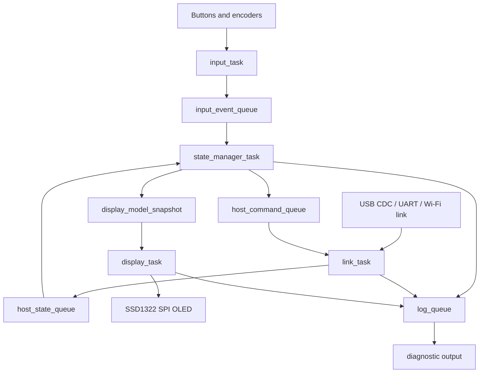
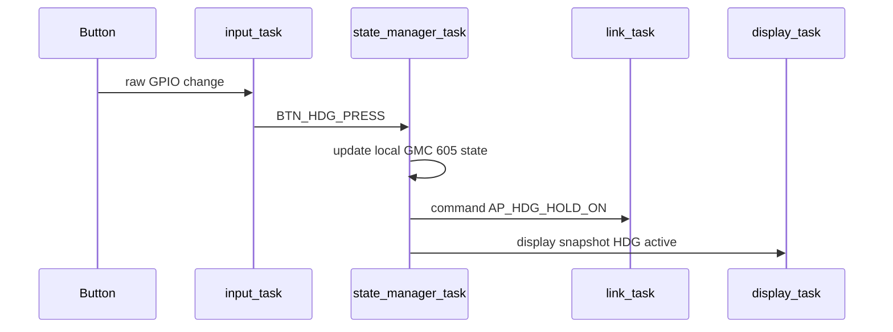
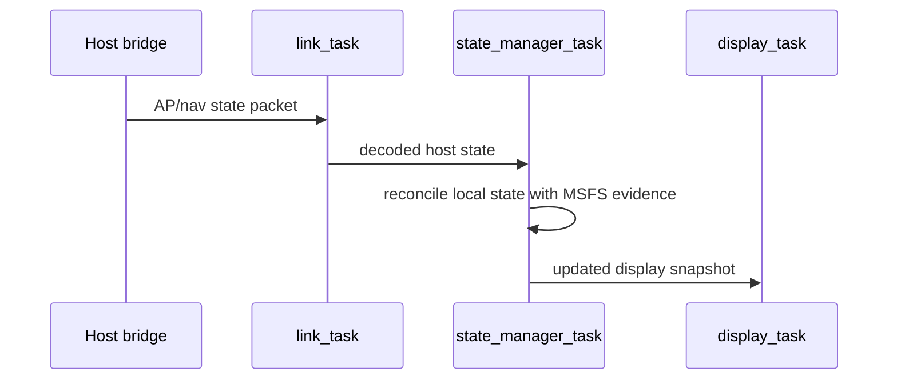
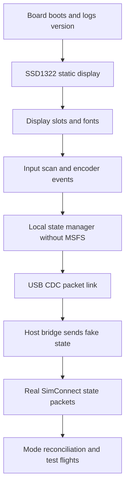

# GMC 605 Firmware Architecture

## Goal

Define a clean ESP-IDF + FreeRTOS firmware architecture for the GMC 605-style MSFS autopilot panel.

Known hardware direction:

- MCU: ESP32-S3 class board/module.
- Display: SSD1322 OLED over SPI.
- MSFS link: host-side SimConnect bridge, most likely over USB CDC serial first.
- Project boundary: simulator-only panel, not real aircraft avionics.

## Architecture Decision

Use an event-driven firmware with one owner per hardware resource.

Key rule:

- Input code never draws the display.
- Display code never talks directly to MSFS.
- MSFS link code never owns Garmin-style mode logic.
- The state manager is the single owner of the local GMC 605 state model.

## High-Level Diagram



## Task Ownership

| Task | Priority | Rate / Trigger | Owns | Output |
|---|---:|---|---|---|
| `input_task` | high | 100-200 Hz scan or ISR-driven | button debounce, encoder events | semantic input events |
| `state_manager_task` | high | event-driven | GMC 605 state, mode transitions, timers | host commands, display snapshots |
| `display_task` | medium | 20-30 Hz, plus dirty updates | SSD1322 driver, framebuffer, flash phase | SPI display updates |
| `link_task` | medium-high | packet-driven, 20-100 Hz host update | USB/Wi-Fi/UART protocol | host state packets and commands |
| `health_task` | low | 1-5 Hz | watchdog, link timeout, task heartbeat | health flags, diagnostics |
| `log_task` | low | best effort | debug output | serial/log sink |

Priority notes:

- `input_task` and `state_manager_task` should feel immediate.
- `display_task` can lag a few tens of milliseconds without hurting usability.
- `link_task` should not block the state manager.
- Logging must never block input or display updates.

## Core Modules

| Module | Responsibility |
|---|---|
| `app_main` | boot order, task creation, watchdog registration |
| `board_config` | GPIO map, SPI host, display pins, encoder/button layout |
| `input_service` | debounce, long/short press, encoder direction |
| `gmc605_state` | local AP/FD/YD/mode/reference model |
| `mode_logic` | vertical/lateral mode transition rules |
| `display_model` | active/armed labels, references, flash/inverse styles |
| `ssd1322_driver` | low-level display init and pixel/byte transfer |
| `display_renderer` | label layout, font choice, grayscale/inverse rendering |
| `host_protocol` | packet encode/decode between ESP32 and PC bridge |
| `msfs_adapter_model` | firmware-side representation of host SimVars |
| `health_monitor` | link timeout, stale data, task heartbeat |
| `test_mocks` | fake inputs and fake host state for bench tests |

## Data Flow

### Button Press



### Host State Update



## State Manager Rules

The state manager should be the only writer for:

- active lateral mode
- armed lateral mode
- active vertical mode
- armed vertical mode
- AP/FD/YD displayed state
- selected references copied into the display model
- alert timers and flash timers
- host command intent

The state manager should receive:

- clean input events
- decoded host state
- timer ticks
- health/link status

It should emit:

- display snapshots
- host command packets
- diagnostics

## Display Architecture

Use two layers:

```text
display_model
    what to show:
    - label text
    - slot
    - style
    - priority
    - expiry time

display_renderer
    how to show it on SSD1322:
    - font
    - x/y position
    - brightness
    - inverse video
    - blink phase
    - SPI transfer
```

This keeps Garmin-style logic out of the SSD1322 driver.

## Display Slots

Suggested first SSD1322 layout:

```text
+------------------------------------------------+
| LAT ACTIVE       AP/YD MSG       VERT ACTIVE   |
| LAT ARMED        REF/ALERT       VERT ARMED    |
+------------------------------------------------+
```

Suggested slot names:

| Slot | Example |
|---|---|
| `display_slot_lat_active` | `HDG`, `GPS`, `LOC`, `ROL` |
| `display_slot_lat_armed` | `GPS`, `VOR`, `LOC`, `BC` |
| `display_slot_status` | `AP`, `YD`, disconnect flash |
| `display_slot_message` | `PFT`, `MINSPEED`, `ESP OFF` |
| `display_slot_vert_active` | `ALT`, `VS`, `IAS`, `FLC`, `GP`, `GS` |
| `display_slot_vert_armed` | `ALTS`, `GP`, `GS`, `VPTH` |
| `display_slot_reference` | `5500`, `+500`, `120KT` |

## Flashing And Alerts

Store flashing as display metadata:

| Field | Meaning |
|---|---|
| `effect` | steady, slow flash, fast flash, inverse flash |
| `started_ms` | when the effect started |
| `expires_ms` | when the effect should stop, or zero for persistent |
| `priority` | resolves conflicts when slots are crowded |

The display task calculates the current visible/inverse phase from `esp_timer_get_time()` or a periodic tick. The state manager only sets the effect.

## SSD1322 Driver Strategy

Recommended first integration:

1. Try U8g2 as an ESP-IDF component.
2. Wrap it behind `display_renderer`.
3. Verify exact module mapping and orientation.
4. Keep the dependency only if it is stable and simple.

Recommended fallback:

1. Write a small SSD1322-only driver.
2. Keep an 8 KB 4-bit framebuffer.
3. Implement only the drawing primitives we need:
   - clear
   - draw bitmap font glyph
   - draw inverse rectangle
   - draw horizontal/vertical line
   - present full framebuffer
4. Keep the same `display_renderer` API.

## Host Link Protocol

Start with USB CDC serial.

Packet types:

| Direction | Packet | Purpose |
|---|---|---|
| ESP32 to host | input command | button/encoder action such as `BTN_AP`, `ENC_ALT_PLUS` |
| ESP32 to host | heartbeat | panel alive, firmware version |
| Host to ESP32 | AP/nav state | condensed SimVar state |
| Host to ESP32 | link/config | aircraft profile, feature flags |
| Host to ESP32 | error/status | host bridge error, MSFS disconnected |

Do not send raw SimVars one by one to the display task. The host bridge should condense MSFS state into a firmware-friendly model.

## Timing Budget

| Function | Target |
|---|---:|
| Button debounce | 20-40 ms |
| Encoder event latency | less than 20 ms preferred |
| Display refresh | 20-30 Hz |
| Flash phase tick | 2-4 Hz visual phase, computed locally |
| Host state update | 10-20 Hz minimum, 50 Hz nice |
| Link timeout indication | 500-1000 ms |

## Core Affinity Suggestion

Start simple and only pin tasks if needed.

Possible ESP32-S3 split:

| Core | Work |
|---|---|
| Core 0 | Wi-Fi/USB stack, link task, logging |
| Core 1 | input task, state manager, display task |

If USB CDC only is used and no Wi-Fi is active, core pinning may not matter at first.

## Error Handling

Firmware should handle:

- host link lost
- stale host state
- display init failure
- stuck button
- encoder bounce/noise
- malformed packets
- host says MSFS disconnected

Display behavior:

- If host link is lost, keep local panel responsive but show `LINK`.
- If MSFS is disconnected, show `SIM`.
- If display init fails, log error and keep input/link tasks alive for diagnostics.

## Testing Strategy

### Hardware-Free Tests

- state transitions from input events
- display model generation
- packet encode/decode
- timer expiry for flashing labels

### Hardware Bench Tests

- SSD1322 static render
- grayscale/inverse/flash effects
- all buttons and encoders
- USB CDC packet loopback
- link timeout display

### MSFS Integration Tests

- AP, FD, YD
- HDG, NAV, APR, BC
- ALT, VS, IAS/FLC
- GS/GP arming and capture
- AP disconnect alert

## Recommended Firmware Bring-Up Order



## Recommended Next Step

Do a display bring-up spike first:

- Add a U8g2 ESP-IDF dependency in a tiny test project.
- Render the exact GMC 605 slot layout on the SSD1322.
- Verify whether `NHD_256X64` or `ZJY_256X64` matches your module.
- Record the working constructor, pins, SPI speed, contrast, and orientation in a board profile document.

