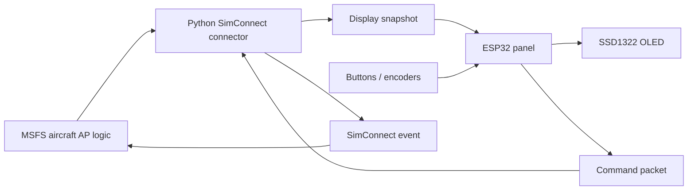

# GMC 605 ESP32 Firmware Architecture

## Goal

Define the ESP32 firmware after the project restart.

The ESP32 is now a simulator panel:

- It receives display state from the Python MSFS connector.
- It renders that state on the SSD1322 OLED.
- It scans buttons and encoders.
- It sends input commands to the Python connector.
- It does not decide autopilot modes.

Simulator boundary: this is for Microsoft Flight Simulator only.

## Sources Used

- User restart instruction: MSFS handles AP logic; ESP32 gets info from MSFS, changes the display, and sends button commands to MSFS.
- Existing project docs under `docs/`.
- Microsoft Flight Simulator SDK SimConnect API reference: https://docs.flightsimulator.com/html/Programming_Tools/SimConnect/SimConnect_API_Reference.htm
- Microsoft Flight Simulator SDK `SimConnect_TransmitClientEvent`: https://docs.flightsimulator.com/html/Programming_Tools/SimConnect/API_Reference/Events_And_Data/SimConnect_TransmitClientEvent.htm

## Architecture Decision

Use a display/input firmware, not an autopilot logic firmware.

| Owner | Owns |
|---|---|
| MSFS aircraft | Real simulator AP state, FD state, YD state, selected references, mode behavior, captures, reversions. |
| Python connector | SimConnect read/write, aircraft adapters, command mapping, web GUI, snapshot creation. |
| ESP32 | Buttons, encoders, OLED rendering, link health, local diagnostics. |

Hard rule:

An ESP32 button press is only a command request. The OLED changes after the connector sends back a new snapshot.

## Data Flow

## ESP32 Tasks

Start with a small task set.

| Task | Priority | Responsibility |
|---|---:|---|
| `input_task` | high | Scan buttons/encoders, debounce, emit semantic command requests. |
| `link_task` | medium-high | Receive connector snapshots and send input commands. |
| `panel_state_task` | medium | Store latest snapshot, track stale/lost link, prepare display model. |
| `display_task` | medium | Own SSD1322, framebuffer, fonts, blink/inverse rendering. |
| `health_task` | low | Watchdog, stuck input detection, diagnostics. |

Do not split into more tasks until a real timing problem appears.

## Firmware Modules

| Module | Keep It Focused On |
|---|---|
| `board_config` | GPIOs, SPI pins, display pins, encoder/button layout. |
| `input_service` | Debounce and encoder direction only. |
| `host_protocol` | Newline JSON or later binary framing. |
| `panel_state` | Latest connector snapshot and link health. |
| `display_model` | Slot text, style, priority, expiry. |
| `display_renderer` | SSD1322 pixels, fonts, brightness, blink phase. |
| `health_monitor` | Link timeout, malformed packets, stuck buttons. |

Avoid modules named like autopilot controllers, guidance managers, or mode engines. That logic belongs in MSFS and the connector adapter.

## Snapshot Model

The connector should send one complete panel snapshot. The ESP32 should not need raw SimVars.

Recommended snapshot groups:

| Group | Examples |
|---|---|
| Link/sim | connector connected, MSFS connected, aircraft profile, timestamp. |
| Key LEDs | AP, FD, YD LED state, disconnect alert, failure alert. |
| Lateral LCD | active label, armed label, source, CDI valid/needle if useful. |
| Vertical LCD | active label, armed labels, GSI/VDEV valid/needle if useful. |
| Mode reference | selected altitude, vertical speed, IAS/FLC speed, pitch reference if known. |
| Messages | `LINK`, `SIM`, `PFT`, `DISABLED`, command pending/fail. |
| Style metadata | steady, dim, inverse, slow flash, fast flash, expires. |

The ESP32 may reject malformed snapshots, but it should not reinterpret AP behavior.

The snapshot should already contain GMC 605-style LCD text such as `GPS`,
`VOR`, `LOC`, `VAPP`, `ALT`, `VS`, `ALTS`, `GP`, or `GS`. Keep richer
diagnostic or aircraft-adapter fields on the connector side unless the ESP32
renderer needs them.

## Command Model

ESP32 to connector commands should be semantic and small.

| Input | Command Meaning |
|---|---|
| `AP` button | Request AP toggle or profile-specific AP action. |
| `FD` button | Request FD toggle. |
| `YD` button | Request YD toggle. |
| `HDG`, `NAV`, `APR`, `BC` | Request lateral mode button press. |
| `ALT`, `VS`, `IAS/FLC` | Request vertical mode button press. |
| Heading encoder | Request heading bug increment/decrement. |
| Altitude encoder | Request selected altitude increment/decrement. |
| VS/speed controls | Request selected reference increment/decrement. |
| AP disconnect | Request AP disconnect. |

The connector maps those commands to SimConnect Key Events, Input Events, or aircraft-specific adapter actions.

## Display Rules

The display task renders what the snapshot says.

GMC 605-style display ownership:

| Area | Firmware Rendering Rule |
|---|---|
| Left LCD upper | Active lateral mode, large/bright. |
| Left LCD lower | Armed lateral mode, smaller. Blank when `NONE`. |
| Center LCD upper | Active vertical mode, large/bright. |
| Center LCD lower | Armed vertical modes, smaller. Blank when empty. |
| Mode reference | Numeric vertical reference when the snapshot supplies one. |
| Right LCD | Short status messages and alerts, up to four lines. |
| AP/FD/YD | Key-adjacent LED indicators, not normal LCD text. |

Allowed local display decisions:

- Blink timing.
- Inverse-video phase.
- Font and slot placement.
- Showing `LINK` when connector packets are stale.
- Showing `SIM` when the connector reports MSFS disconnected.
- Keeping the last good snapshot briefly during a link timeout.

Not allowed in ESP32 firmware:

- Turning `HDG` active because the `HDG` button was pressed.
- Arming `GP` because `APR` was pressed.
- Inventing `ALT`, `ALTS`, `GS`, `GP`, or `VPTH` transitions.
- Resolving aircraft-specific MSFS behavior.

## Link Protocol

First version:

- Newline-delimited UTF-8 JSON.
- Start at `115200 8N1` or USB CDC serial.
- Each line is one complete message.
- Every message includes protocol version and type.

Message types:

| Direction | Type | Purpose |
|---|---|---|
| Connector to ESP32 | `hello` | Protocol/version/profile. |
| Connector to ESP32 | `snapshot` | Complete display state. |
| Connector to ESP32 | `command_result` | Command accepted/rejected/failed. |
| Connector to ESP32 | `error` | Connector or MSFS problem. |
| ESP32 to connector | `command` | Button/encoder request. |
| ESP32 to connector | `heartbeat` | Panel alive and firmware version. |

Readable JSON is acceptable for bring-up. Move to binary only after measurement shows JSON is the problem.

## Timing Targets

| Function | Target |
|---|---:|
| Button debounce | 20-40 ms |
| Encoder event latency | under 20 ms preferred |
| Display refresh | 20-30 Hz |
| Connector snapshot rate | 5-20 Hz |
| Link stale indication | 500-1000 ms |
| Link lost indication | 2-3 seconds |

## Error Handling

| Condition | ESP32 Behavior |
|---|---|
| No connector yet | Show `LINK`; inputs may still be logged locally. |
| Connector alive, MSFS disconnected | Show `SIM`. |
| Snapshot stale | Keep last snapshot and show stale/link marker. |
| Snapshot invalid | Ignore packet, count error, keep previous valid snapshot. |
| Command rejected | Show short command-fail message if connector provides one. |
| Display init failed | Keep link/input alive for diagnostics. |

## Bring-Up Order

1. Render a static SSD1322 test screen.
2. Scan buttons and encoders.
3. Send button/encoder command packets to a debug connector.
4. Receive fake snapshots from the connector and render them.
5. Add link stale/lost display behavior.
6. Connect the Python connector to real MSFS.
7. Tune labels and aircraft adapter behavior from logged flights.

## Recommended Next Step

Build the connector web GUI and ESP32 fake-snapshot loop together.

That gives fast feedback without waiting for every MSFS aircraft mode edge case.
