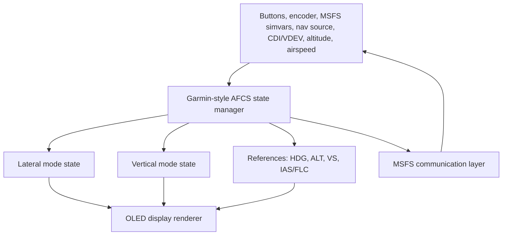

# GFC 600 Operation Logic Research Summary

## Goal

Capture Garmin GFC 600-style autopilot behavior for this MSFS-only ESP32 project:

- Vertical mode logic.
- Lateral mode logic.
- Display annunciation logic.
- Conditions where each common label should appear.

This document is for simulator control/display behavior only. It is not suitable for real aircraft modification, certification, or flight-critical use.

## Sources Used

Primary source:

- Garmin, `GFC 600 Automatic Flight Control System (with Color Display) Pilot's Guide`, part number `190-03090-00 Rev. A`, January 2024. Official PDF: https://static.garmin.com/pumac/190-03090-00_a.pdf

Secondary cross-check:

- Garmin, `GFC 600 Pilot's Guide`, part number `190-01488-00 Rev. H`. Official PDF: https://static.garmin.com/pumac/190-01488-00_h.pdf

## Confirmed Facts

### System Structure

- The GFC 600 is an attitude-based AFCS with Flight Director, Autopilot, optional Yaw Damper, optional Manual Electric Trim, optional Autotrim, and ESP.
- The GMC 605C-IAS / GMC 605C-FLC is the primary user interface for mode selection.
- The color LCD layout is:
  - Left: lateral modes.
  - Center: AP/YD engagement, messages, alerts.
  - Right: vertical modes.
- Active modes are green.
- Armed modes are white.
- Yellow is used for some attention/status cases such as dropped modes on the GI 285.
- Red is used for abnormal disconnect or failure conditions.
- Text can flash or alternate normal/inverse video to get pilot attention.

### Flight Director and Autopilot

- If AP is pressed while FD is already on, the autopilot follows the active FD commands.
- If AP is pressed while FD is off, FD turns on with default `PIT` and `ROL` modes.
- Pressing FD activates the Flight Director, but not necessarily the autopilot servos.
- Manual AP disconnect causes aural alerting and yellow AP flashing for about 5 seconds.
- `AP_ON` with `FD_OFF` is not a valid normal state because AP follows FD commands.
- The GFC 600 guide does not explicitly tabulate every ordinary mode-key press
  with FD off. For this project, a valid ordinary mode selection enables FD in
  the selected mode and uses the default mode on the other axis. See
  [GFC 600 Mode-Key Behavior With FD And AP Off](gfc600-mode-key-behavior-fd-ap-off.md).

### Vertical Modes

| Label | Meaning | Active/Armed Behavior |
|---|---|---|
| `PIT` | Pitch Hold | Default vertical mode when FD/AP starts. Holds current pitch attitude. |
| `LVL` | Level Mode | Coupled pitch/roll mode. Cancels other modes and commands zero vertical speed and wings level. |
| `GA` | Go Around | Coupled pitch/roll mode. Constant nose-up pitch and zero bank. |
| `ALT` | Altitude Hold | Holds current altitude, or selected altitude after capture. |
| `ALTS` | Selected Altitude Capture | Armed automatically when selected altitude capture is available and `PIT`, `VS`, `IAS`, `FLC`, or `GA` is active. Becomes active near target altitude, then transitions to `ALT`. |
| `VS` | Vertical Speed | Holds selected vertical speed reference. |
| `IAS` | Indicated Airspeed | Holds selected IAS reference using pitch. Power must be managed separately. |
| `FLC` | Flight Level Change | Holds IAS/Mach while climbing/descending to selected altitude. |
| `VPTH` | VNAV Vertical Path | Captures/tracks descent legs of an active vertical profile. |
| `ALTV` | VNAV constraint altitude capture | Captures vertical-path constraint altitude. On GI 285 this may be represented as `ALT`. |
| `GP` | Glidepath | Tracks SBAS GPS glidepath during approach. |
| `GS` | Glideslope | Tracks ILS glideslope during approach. |

### Lateral Modes

| Label | Meaning | Active/Armed Behavior |
|---|---|---|
| `ROL` | Roll Hold | Default lateral mode. Holds bank, levels wings, or limits bank depending on activation bank angle. |
| `LVL` | Level Mode | Coupled pitch/roll mode. Commands zero bank. |
| `GA` | Go Around | Coupled pitch/roll mode. Commands zero bank. |
| `HDG` | Heading Select | Tracks selected heading. |
| `GPS` | GPS Nav or GPS Approach | Captures/tracks GPS nav source. In APR, glidepath may be armed. |
| `VOR` | VOR Navigation | Captures/tracks selected VOR course. |
| `VAPP` | VOR Approach on GMC display | VOR approach mode. GI 285 may show only `VOR`. |
| `LOC` | Localizer Nav or Localizer Approach | Captures/tracks localizer. In LOC APR, glideslope may be armed. |
| `BC` | Backcourse | Captures/tracks localizer backcourse. |
| `TRACK MODE` | Reversionary GPS Track | Displayed when heading is lost in supported TXi installations and GPS track is used. |

### Roll Hold Details

When `ROL` is selected:

| Bank angle at activation | Response |
|---|---|
| Less than 6 deg | Roll wings level. |
| 6 to 25 deg | Maintain current bank angle. |
| More than 25 deg | Limit commanded bank to 25 deg. |

If `ROL` occurs because of a mode reversion, the FD commands wings level.

### Navigation and Approach Capture

- `NAV` selects navigation tracking for the selected source: GPS, VOR, or LOC.
- `APR` selects approach tracking for the selected source: GPS, VOR, or LOC.
- If CDI deflection is greater than half scale when `NAV` or `APR` is pressed, the mode arms first.
- If CDI deflection is less than half scale, the mode can capture immediately.
- GPS approach arms `GP`.
- LOC approach arms `GS`.
- The AFCS may revert to `ROL` if the navigation source changes in installations that do not support autoswitching.

### VNAV

- VNAV requires a GPS flight plan with altitude constraints and supported equipment.
- Pressing `VNV` arms vertical path behavior.
- At top of descent, `VPTH` becomes active.
- `ALTV` captures vertical path constraint altitudes.
- VNAV can autoswitch to `GP` or `LOC/GS` in supported GTN-based installations with autoswitching enabled.

### Display Rules

| Display Area | Content |
|---|---|
| Left active lateral field | Active lateral mode: `ROL`, `HDG`, `GPS`, `VOR`, `LOC`, `BC`, `LVL`, `GA`. |
| Left armed lateral field | Armed lateral mode when capture has not occurred yet. |
| Center status field | `AP`, `YD`, messages, alerts, disconnect/failure state. |
| Right active vertical field | Active vertical mode: `PIT`, `ALT`, `VS`, `IAS`, `FLC`, `VPTH`, `GP`, `GS`, `LVL`, `GA`. |
| Right armed vertical field | Armed vertical mode: commonly `ALTS`, `ALT`, `GP`, `GS`, `VPTH`. |
| Reference field | Numeric reference next to active vertical mode for `ALT`, `VS`, `IAS`, `FLC`; units are not shown on the GMC. |

## Assumptions For This MSFS Project

- The ESP32 panel should mimic labels and state behavior, not certified servo logic.
- MSFS autopilot variables/events may not map one-to-one to Garmin labels. A local state manager should own Garmin-style annunciation state.
- The display should be modeled as a deterministic annunciator surface:
  - active lateral mode
  - armed lateral mode
  - active vertical mode
  - armed vertical modes
  - references
  - AP/YD/FD status
  - message queue
- Where MSFS cannot expose exact capture-state timing, we can approximate using CDI deviation, vertical deviation, selected altitude, current altitude, and active nav source.

## High-Level Logic Diagram

## Project Logic Takeaways

- Treat `LVL` and `GA` as coupled modes: they set both lateral and vertical labels.
- Treat `ALTS`, `GP`, `GS`, `VPTH`, and sometimes `ALT` as armed/capture states, not just button labels.
- Do not depend only on MSFS active autopilot modes for annunciation. Keep a Garmin-style mode model in firmware or host software.
- Add a display layer that knows color/priority/flashing rules separately from mode-selection logic.

## Open Questions

- Which exact physical panel variant are we mimicking: GMC 605C-IAS or GMC 605C-FLC?
- Should the OLED show the newer color-display layout or the older GI 285-like annunciator layout?
- Which aircraft/autopilot in MSFS will be the first target for variable/event mapping?
- Can MSFS expose enough VNAV state for credible `VPTH` and `ALTV`, or should those be local approximations?

## Recommended Next Step

Choose the first target display model:

- `GMC 605C-style`: active/armed lateral left, AP/YD/messages center, active/armed vertical right, references visible.
- `GI 285-style`: simpler lateral/status/vertical annunciator.

