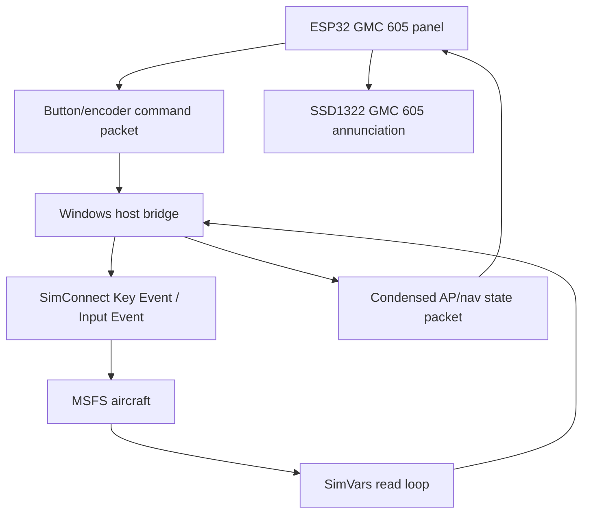

# MSFS SimVar And Event Map For GMC 605-Style Panel

## Goal

Identify which Microsoft Flight Simulator variables and events should be used by the firmware or host bridge for a GMC 605-style GFC 600 panel.

This document is simulator-only. It does not describe certified avionics behavior.

Related documents:

- [GFC 600 Mode Logic](../state-machines/gfc600-mode-logic.md) defines the
  local Garmin-style state and transition rules.
- [GMC 605 Firmware Architecture](../design-decisions/gmc605-firmware-architecture.md)
  defines the ESP32 and host-bridge ownership split.

## Sources Used

Primary official sources:

- Microsoft Flight Simulator SDK SimConnect API reference: https://docs.flightsimulator.com/html/Programming_Tools/SimConnect/SimConnect_API_Reference.htm
- `SimConnect_TransmitClientEvent`: https://docs.flightsimulator.com/html/Programming_Tools/SimConnect/API_Reference/Events_And_Data/SimConnect_TransmitClientEvent.htm
- Aircraft Autopilot / Assistant SimVars: https://docs.flightsimulator.com/html/Programming_Tools/SimVars/Aircraft_SimVars/Aircraft_AutopilotAssistant_Variables.htm
- Aircraft Autopilot / Flight Assist Key Events: https://docs.flightsimulator.com/msfs2024/html/6_Programming_APIs/Key_Events/Aircraft_Autopilot_Flight_Assist_Events.htm
- Aircraft Radio Navigation SimVars: https://docs.flightsimulator.com/msfs2024/html/6_Programming_APIs/SimVars/Aircraft_SimVars/Aircraft_RadioNavigation_Variables.htm

Subagent used:

- A research subagent was used specifically for the MSFS SDK mapping. Its result was consolidated here.

## Core Approach

Use three layers:

| Layer | Use |
|---|---|
| SimVars | Read aircraft/AP/nav status. |
| Key Events / Client Events | Send button/knob commands to MSFS. |
| Aircraft-specific Input Events | Use only when generic SimVars/events cannot control a specific aircraft correctly. |

For SimConnect:

- Map Key Events with `SimConnect_MapClientEventToSimEvent`.
- Send commands with `SimConnect_TransmitClientEvent`.
- In JS gauge terms, the same events are often called as `K:<event>`.

## Autopilot, FD, YD, Disconnect

| Area | Variable / Event | Direction | Unit / Type | Use | Confidence |
|---|---|---|---|---|---|
| AP status | `AUTOPILOT MASTER` | read | bool | AP engaged/disengaged status | high |
| AP command | `AP_MASTER`, `AUTOPILOT_ON`, `AUTOPILOT_OFF` | write | event | AP button | high |
| FD status | `AUTOPILOT FLIGHT DIRECTOR ACTIVE` | read | bool | FD annunciation | high |
| FD command | `TOGGLE_FLIGHT_DIRECTOR`, `SYNC_FLIGHT_DIRECTOR_PITCH` | write | event | FD toggle and pitch sync | high |
| YD status | `AUTOPILOT YAW DAMPER` | read | bool | YD annunciation | high |
| YD command | `YAW_DAMPER_TOGGLE`, `YAW_DAMPER_ON`, `YAW_DAMPER_OFF`, `YAW_DAMPER_SET` | write | event / bool param | YD button | high |
| Disconnect status | `AUTOPILOT DISENGAGED` | read | bool | AP disconnect alert/latch | high |
| Disconnect command | `AUTOPILOT_DISENGAGE_SET`, `AUTOPILOT_DISENGAGE_TOGGLE` | write | event / bool param | AP DISC command | high |
| AP availability | `AUTOPILOT AVAILABLE` | read | bool | failure-ish/unavailable state | medium |

## Lateral Modes

| Area | Variable / Event | Direction | Unit / Type | Use | Confidence |
|---|---|---|---|---|---|
| ROL inference | `AUTOPILOT BANK HOLD`, `AUTOPILOT WING LEVELER`, `AUTOPILOT DEFAULT ROLL MODE` | read | bool / enum | infer roll hold/default lateral mode | medium |
| ROL command | `AP_BANK_HOLD`, `AP_WING_LEVELER` | write | event | roll/wing-level fallback | medium |
| HDG active | `AUTOPILOT HEADING LOCK` | read | bool | `HDG` active label | high |
| HDG command | `AP_HDG_HOLD_ON`, `AP_HDG_HOLD_OFF`, `AP_PANEL_HEADING_ON`, `AP_PANEL_HEADING_OFF`, `AP_PANEL_HEADING_SET` | write | event / bool | HDG button | high |
| NAV active | `AUTOPILOT NAV1 LOCK` | read | bool | NAV active/armed-ish lateral tracking | high |
| NAV command | `AP_NAV1_HOLD_ON`, `AP_NAV1_HOLD_OFF`, `AP_NAV_SELECT_SET` | write | event / nav index | NAV button and nav radio select | high |
| APR state | `AUTOPILOT APPROACH HOLD`, `AUTOPILOT APPROACH ARM`, `AUTOPILOT APPROACH ACTIVE`, `AUTOPILOT APPROACH CAPTURED` | read | bool | APR armed/active/capture inference | high |
| APR command | `AP_APR_HOLD_ON`, `AP_APR_HOLD_OFF` | write | event | APR button | high |
| BC active | `AUTOPILOT BACKCOURSE HOLD` | read | bool | `BC` active label | high |
| BC command | `AP_BC_HOLD_ON`, `AP_BC_HOLD_OFF` | write | event | BC button | high |
| LOC source | `AUTOPILOT APPROACH IS LOCALIZER`, `HSI HAS LOCALIZER`, `NAV HAS LOCALIZER:index` | read | bool | infer `LOC` label/source | high |
| LOC command | `AP_LOC_HOLD_ON`, `AP_LOC_HOLD_OFF` | write | event | LOC-only hold/capture | high |
| GPS source | `GPS DRIVES NAV1` | read | bool | CDI source: GPS vs NAV1 | high |
| GPS approach | `GPS IS ACTIVE FLIGHT PLAN`, `GPS IS APPROACH ACTIVE`, `GPS APPROACH APPROACH TYPE` | read | bool / enum | GPS/GPS approach context | medium |
| VOR source inference | `GPS DRIVES NAV1=false` + `NAV HAS NAV:index=true` + `NAV HAS LOCALIZER:index=false` | read | bool combo | infer `VOR` label | medium |

## Vertical Modes

| Area | Variable / Event | Direction | Unit / Type | Use | Confidence |
|---|---|---|---|---|---|
| PIT active | `AUTOPILOT PITCH HOLD`, `AUTOPILOT PITCH HOLD REF` | read | bool / radians | `PIT` active and pitch reference | high |
| PIT command | `AP_PITCH_REF_SET`, `AP_PITCH_REF_INC_UP`, `AP_PITCH_REF_INC_DN`, `AP_ATT_HOLD_ON`, `AP_ATT_HOLD_OFF` | write | event | pitch hold/ref commands | medium |
| ALT active | `AUTOPILOT ALTITUDE LOCK` | read | bool | `ALT` active label | high |
| ALT command | `AP_ALT_HOLD_ON`, `AP_ALT_HOLD_OFF`, `AP_PANEL_ALTITUDE_ON`, `AP_PANEL_ALTITUDE_OFF`, `AP_PANEL_ALTITUDE_SET` | write | event / bool | ALT button | high |
| ALTS inference | `AUTOPILOT ALTITUDE ARM` + selected altitude/current altitude | read | bool + feet | selected altitude capture inference | medium |
| VS active/ref | `AUTOPILOT VERTICAL HOLD`, `AUTOPILOT VERTICAL HOLD VAR` | read | bool / ft/min | `VS` active and selected VS | high |
| VS command | `AP_VS_ON`, `AP_VS_OFF`, `AP_VS_SET`, `AP_VS_VAR_SET_ENGLISH` | write | event / ft/min + slot | VS mode/ref | high |
| IAS active/ref | `AUTOPILOT AIRSPEED HOLD`, `AUTOPILOT AIRSPEED HOLD VAR` | read | bool / knots | `IAS` active and selected IAS | high |
| IAS command | `AP_AIRSPEED_ON`, `AP_AIRSPEED_OFF`, `AP_AIRSPEED_SET`, `AP_SPD_VAR_SET_EX1` | write | event / scaled knots + slot | IAS mode/ref | high |
| FLC active | `AUTOPILOT FLIGHT LEVEL CHANGE` | read | bool | `FLC` active label | high |
| FLC command | `FLIGHT_LEVEL_CHANGE_ON`, `FLIGHT_LEVEL_CHANGE_OFF` | write | event | FLC button | high |
| GS state | `AUTOPILOT GLIDESLOPE ARM`, `AUTOPILOT GLIDESLOPE HOLD`, `AUTOPILOT GLIDESLOPE ACTIVE` | read | bool | `GS` armed/active/captured | high |
| GP data | `GPS HAS GLIDEPATH`, `GPS GSI NEEDLE`, `GPS GSI SCALING`, `GPS VERTICAL ERROR` | read | bool / needle / meters | GPS glidepath availability/deviation | medium |
| VNAV data | `GPS WP VERTICAL SPEED`, `GPS TARGET ALTITUDE`, `GPS VERTICAL ERROR`, `GPS WP NEXT ALT` | read | m/s, meters | advisory VNAV data; generic AP VNAV control is weak | low |

## Selected References

| Area | Variable / Event | Direction | Unit / Type | Use | Confidence |
|---|---|---|---|---|---|
| Selected heading | `AUTOPILOT HEADING LOCK DIR` | read | degrees | heading bug display | high |
| Set heading | `HEADING_BUG_SET`, `AP_HEADING_BUG_SET_EX1` | write | degrees / scaled int + index | HDG knob | high |
| Selected altitude | `AUTOPILOT ALTITUDE LOCK VAR`, `AUTOPILOT ALTITUDE SLOT INDEX` | read | feet / number | selected altitude display | high |
| Set altitude | `AP_ALT_VAR_SET_ENGLISH`, `ALTITUDE_SLOT_INDEX_SET` | write | feet + slot | ALT knob / slot select | high |
| Selected VS | `AUTOPILOT VERTICAL HOLD VAR`, `AUTOPILOT VS SLOT INDEX` | read | ft/min / number | VS reference display | high |
| Set VS | `AP_VS_VAR_SET_ENGLISH`, `VS_SLOT_INDEX_SET` | write | ft/min + slot | VS wheel / selected slot | high |
| Selected IAS | `AUTOPILOT AIRSPEED HOLD VAR`, `AUTOPILOT SPEED SLOT INDEX` | read | knots / number | IAS/FLC speed reference | high |
| Set IAS | `AP_SPD_VAR_SET_EX1`, `SPEED_SLOT_INDEX_SET` | write | scaled knots + slot | IAS/FLC knob | high |

## Nav Source, CDI, GSI

| Area | Variable | Direction | Unit / Type | Use | Confidence |
|---|---|---|---|---|---|
| HSI CDI | `HSI CDI NEEDLE`, `HSI CDI NEEDLE VALID`, `HSI STATION IDENT`, `HSI TF FLAGS` | read | needle, bool, string, enum | best generic CDI/source status | high |
| HSI GSI | `HSI GSI NEEDLE`, `HSI GSI NEEDLE VALID` | read | needle, bool | best generic vertical guidance status | high |
| NAV raw CDI | `NAV CDI:index`, `NAV HAS NAV:index`, `NAV CODES:index`, `NAV TOFROM:index` | read | needle, bool, flags, enum | raw VOR/LOC validity/deviation | high |
| NAV glideslope | `NAV HAS GLIDE SLOPE:index`, `NAV GSI:index`, `NAV GS FLAG:index`, `NAV GLIDE SLOPE ERROR:index` | read | bool / needle / degrees | ILS GS validity/deviation | high |
| GPS CDI | `GPS CDI NEEDLE`, `GPS CDI SCALING`, `GPS WP CROSS TRK` | read | needle, meters | raw GPS lateral deviation | high |
| GPS glidepath | `GPS HAS GLIDEPATH`, `GPS GSI NEEDLE`, `GPS GSI SCALING`, `GPS VERTICAL ERROR` | read | bool / needle / meters | GPS glidepath availability/deviation | medium |

## Firmware / Host Split

Recommended split:

| Component | Responsibility |
|---|---|
| ESP32 firmware | buttons, encoders, display, local GMC 605 mode model, watchdog of host link |
| Host SimConnect app | SimVars read loop, Key Event transmission, aircraft-specific Input Event adaptation |
| Local protocol | compact state packets and button/encoder commands |

Do not put SimConnect directly on ESP32. MSFS SimConnect normally belongs in a Windows-side bridge app.

## Read/Write Workflow

## Important Assumptions

- Generic MSFS autopilot variables will not perfectly expose Garmin-style `ALTS`, `VPTH`, `GP`, `GS`, and capture timing for every aircraft.
- The local GMC 605 state manager should own annunciation logic and use MSFS data to confirm/correct it.
- Aircraft-specific Working Title or third-party avionics may require Input Events or LVars/HVars. Treat those as per-aircraft adapters, not the baseline protocol.

## Recommended Next Step

Build a small host-side SimConnect probe before firmware work:

1. Log the variables in this document at 10-20 Hz.
2. Fly simple HDG, NAV, APR, ALT, VS, IAS/FLC scenarios.
3. Compare logged variables against the expected GMC 605 labels.
4. Mark which variables are reliable for the first target MSFS aircraft.

