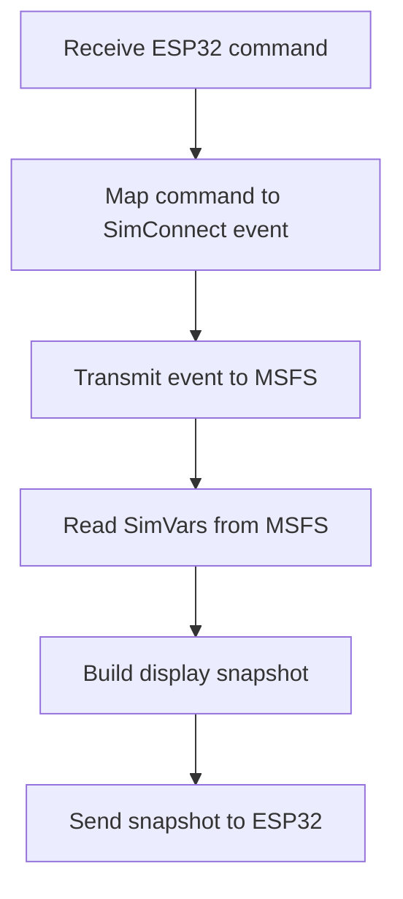

# MSFS SimVar And Event Map For GMC 605-Style Panel

## Goal

Define the first SimConnect map for the Python connector.

The connector reads MSFS state, sends display snapshots to ESP32, receives ESP32 button/encoder commands, and sends commands back to MSFS.

The ESP32 does not talk to SimConnect directly.

## Sources Used

- User restart instruction.
- Existing project SimVar/event map, simplified.
- Microsoft Flight Simulator SDK SimConnect API reference: https://docs.flightsimulator.com/html/Programming_Tools/SimConnect/SimConnect_API_Reference.htm
- `SimConnect_MapClientEventToSimEvent`: https://docs.flightsimulator.com/html/Programming_Tools/SimConnect/API_Reference/Events_And_Data/SimConnect_MapClientEventToSimEvent.htm
- `SimConnect_TransmitClientEvent`: https://docs.flightsimulator.com/html/Programming_Tools/SimConnect/API_Reference/Events_And_Data/SimConnect_TransmitClientEvent.htm
- Aircraft Autopilot / Assistant SimVars: https://docs.flightsimulator.com/html/Programming_Tools/SimVars/Aircraft_SimVars/Aircraft_AutopilotAssistant_Variables.htm
- Aircraft Autopilot / Flight Assist Key Events: https://docs.flightsimulator.com/msfs2024/html/6_Programming_APIs/Key_Events/Aircraft_Autopilot_Flight_Assist_Events.htm

## Confirmed Facts

- SimConnect is the PC-side interface for MSFS add-on clients.
- SimConnect can request data from the user aircraft.
- SimConnect can map simulator events and transmit client events.
- MSFS exposes many autopilot SimVars and autopilot key events.
- Generic SimVars may not expose every Garmin-style armed/captured mode cleanly for every aircraft.

## Core Connector Workflow

## Baseline Read SimVars

Use these first because they are generic and useful for a basic display.

| Display Need | SimVar |
|---|---|
| AP on/off | `AUTOPILOT MASTER` |
| FD on/off | `AUTOPILOT FLIGHT DIRECTOR ACTIVE` |
| YD on/off | `AUTOPILOT YAW DAMPER` |
| AP disconnect alert | `AUTOPILOT DISENGAGED` |
| AP availability | `AUTOPILOT AVAILABLE` |
| HDG active | `AUTOPILOT HEADING LOCK` |
| NAV active | `AUTOPILOT NAV1 LOCK` |
| APR active/armed | `AUTOPILOT APPROACH HOLD`, `AUTOPILOT APPROACH ARM`, `AUTOPILOT APPROACH ACTIVE`, `AUTOPILOT APPROACH CAPTURED` |
| BC active | `AUTOPILOT BACKCOURSE HOLD` |
| LOC source | `AUTOPILOT APPROACH IS LOCALIZER`, `HSI HAS LOCALIZER` |
| GPS drives NAV | `GPS DRIVES NAV1` |
| ALT active | `AUTOPILOT ALTITUDE LOCK` |
| ALT armed | `AUTOPILOT ALTITUDE ARM` |
| VS active/ref | `AUTOPILOT VERTICAL HOLD`, `AUTOPILOT VERTICAL HOLD VAR` |
| IAS active/ref | `AUTOPILOT AIRSPEED HOLD`, `AUTOPILOT AIRSPEED HOLD VAR` |
| FLC active | `AUTOPILOT FLIGHT LEVEL CHANGE` |
| GS state | `AUTOPILOT GLIDESLOPE ARM`, `AUTOPILOT GLIDESLOPE HOLD`, `AUTOPILOT GLIDESLOPE ACTIVE` |
| Selected heading | `AUTOPILOT HEADING LOCK DIR` |
| Selected altitude | `AUTOPILOT ALTITUDE LOCK VAR` |

## Baseline Command Events

Map ESP32 commands to these first.

| ESP32 Command | Candidate MSFS Events |
|---|---|
| AP button | `AP_MASTER`, `AUTOPILOT_ON`, `AUTOPILOT_OFF` |
| FD button | `TOGGLE_FLIGHT_DIRECTOR` |
| YD button | `YAW_DAMPER_TOGGLE`, `YAW_DAMPER_ON`, `YAW_DAMPER_OFF` |
| AP disconnect | `AUTOPILOT_DISENGAGE_SET`, `AUTOPILOT_DISENGAGE_TOGGLE` |
| HDG | `AP_HDG_HOLD_ON`, `AP_HDG_HOLD_OFF`, `AP_PANEL_HEADING_ON` |
| NAV | `AP_NAV1_HOLD_ON`, `AP_NAV1_HOLD_OFF`, `AP_NAV_SELECT_SET` |
| APR | `AP_APR_HOLD_ON`, `AP_APR_HOLD_OFF` |
| BC | `AP_BC_HOLD_ON`, `AP_BC_HOLD_OFF` |
| ALT | `AP_ALT_HOLD_ON`, `AP_ALT_HOLD_OFF` |
| VS | `AP_VS_ON`, `AP_VS_OFF`, `AP_VS_VAR_SET_ENGLISH` |
| IAS | `AP_AIRSPEED_ON`, `AP_AIRSPEED_OFF`, `AP_SPD_VAR_SET_EX1` |
| FLC | `FLIGHT_LEVEL_CHANGE_ON`, `FLIGHT_LEVEL_CHANGE_OFF` |
| Heading encoder | `HEADING_BUG_SET`, `AP_HEADING_BUG_SET_EX1` |
| Altitude encoder | `AP_ALT_VAR_SET_ENGLISH`, `ALTITUDE_SLOT_INDEX_SET` |

The connector should read back state after sending an event. A command result only says whether the connector sent the event; it is not proof that MSFS accepted the resulting mode.

## Display Label Mapping

Start conservative.

Generic MSFS SimVars can approximate the GMC 605 display, but they do not prove
the exact Garmin armed/capture state for every aircraft. The connector should
prefer known active MSFS state over a guessed Garmin-style label and leave slots
blank when the state is not reliable.

| Snapshot Label | Suggested Source |
|---|---|
| AP LED | `AUTOPILOT MASTER` |
| FD LED | `AUTOPILOT FLIGHT DIRECTOR ACTIVE` |
| YD LED | `AUTOPILOT YAW DAMPER` |
| `HDG` | `AUTOPILOT HEADING LOCK` |
| `GPS` | NAV active with `GPS DRIVES NAV1`, or GPS approach with `GP` armed/active when confirmed. |
| `LOC` | NAV active with localizer source, or LOC approach with `GS` armed/active when confirmed. |
| `VOR` | NAV active, not GPS, not LOC, valid VOR source. |
| `VAPP` | VOR approach mode. The GMC 605 uses `VAPP`; the GI 285 may show `VOR`. |
| `BC` | `AUTOPILOT BACKCOURSE HOLD` |
| `ALT` | `AUTOPILOT ALTITUDE LOCK` |
| `ALTS` | `AUTOPILOT ALTITUDE ARM`, if reliable in target aircraft |
| `VS` | `AUTOPILOT VERTICAL HOLD` |
| `IAS` | `AUTOPILOT AIRSPEED HOLD` |
| `FLC` | `AUTOPILOT FLIGHT LEVEL CHANGE` |
| `GS` | glideslope hold/active/arm vars |
| `GP` | aircraft adapter only unless reliable GPS glidepath data is confirmed |

AP, FD, and YD are key LED states in the GMC 605-style model. They should not be
sent as normal LCD mode text.

If two labels conflict, prefer a known active MSFS mode over a guessed Garmin-style mode.

## Aircraft Adapter Rule

Generic mode mapping is phase 1.

Use a Python aircraft adapter when:

- Generic SimVars do not expose armed/captured state.
- The aircraft uses custom Input Events.
- The aircraft needs LVars/HVars.
- The display label differs from generic MSFS state.
- The connector web GUI needs per-aircraft diagnostics.
- GP/GS, ALTS, IAS/FLC, or NAV/APR source state needs more precision than the
  baseline SimVars provide.

Adapters are PC-side only. Do not push this complexity into ESP32 firmware.

## Open Questions

- First aircraft profile.
- Whether the first speed mode label should be `IAS` or `FLC`.
- Which AP events work best in the selected aircraft.
- Whether MSFS 2020 and MSFS 2024 need separate event mappings for the first profile.
- Which GPS glidepath variables are reliable enough for `GP`.

## Recommended Next Step

Add a connector probe screen that logs the baseline SimVars at 5-20 Hz while you press AP, FD, HDG, NAV, APR, ALT, VS, and FLC in the selected MSFS aircraft.
