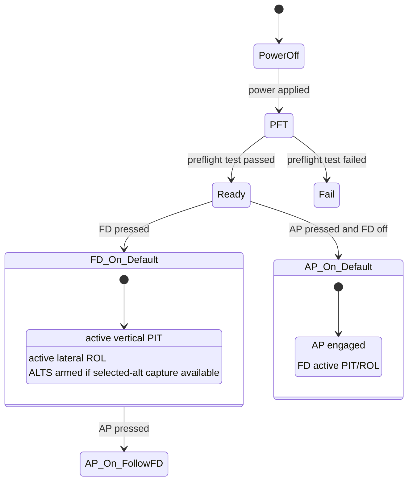
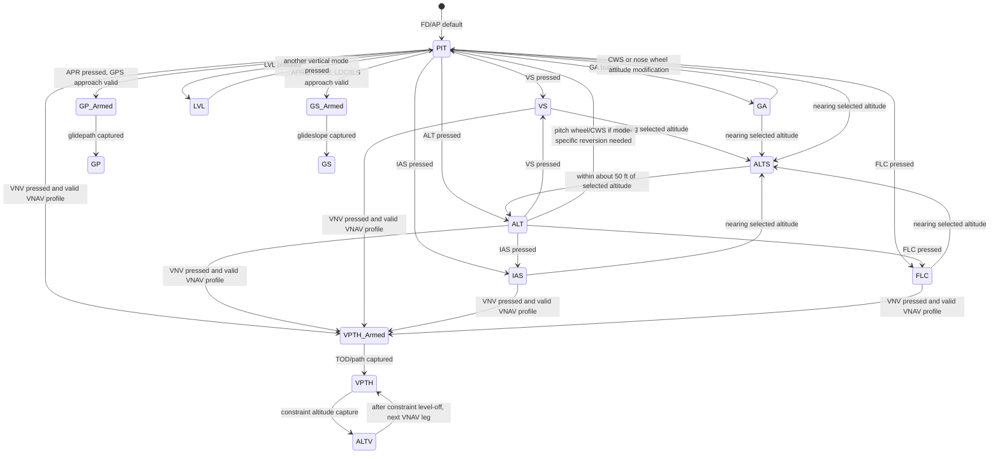
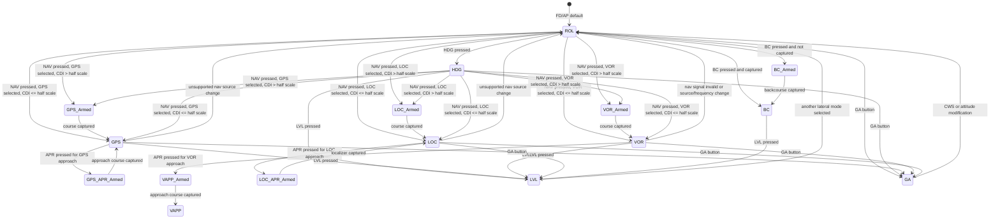
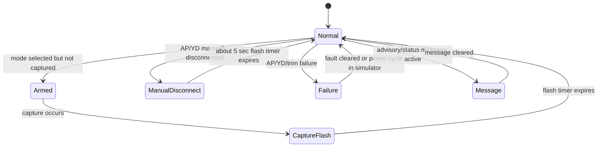

# GFC 600-Style Mode State Machines

This document converts Garmin GFC 600 pilot-guide behavior into simulator-oriented state machines for the ESP32/MSFS project.

Primary source: Garmin `GFC 600 Automatic Flight Control System (with Color Display) Pilot's Guide`, `190-03090-00 Rev. A`, January 2024.

Simulator boundary: this describes display and MSFS control logic only. It is not real aircraft autopilot guidance logic.

## State Model

Use independent but coordinated state groups:

| Group | Example State |
|---|---|
| Flight director | `fd_off`, `fd_on` |
| Autopilot | `ap_off`, `ap_on`, `ap_manual_disconnect_flash`, `ap_fail` |
| Yaw damper | `yd_off`, `yd_on`, `yd_disconnect_flash`, `yd_fail` |
| Active lateral | `ROL`, `HDG`, `GPS`, `VOR`, `LOC`, `BC`, `LVL`, `GA` |
| Armed lateral | none, `GPS`, `VOR`, `LOC`, `BC` |
| Active vertical | `PIT`, `ALT`, `VS`, `IAS`, `FLC`, `VPTH`, `GP`, `GS`, `LVL`, `GA`, `ALTS`, `ALTV` |
| Armed vertical | none, `ALTS`, `ALT`, `VPTH`, `GP`, `GS` |
| Reference values | pitch ref, altitude ref, VS ref, IAS/FLC ref |
| Messages | `PFT`, `PFT FAIL`, `MINSPEED`, `MAXSPEED`, `ESP OFF`, `SET HDG=CRS`, etc. |

## Startup and Default Modes

Implementation notes:

- If AP is pressed while FD is off, set FD on and initialize `PIT`/`ROL`.
- If FD is already on, AP engagement should not change the active modes.
- If YD exists and should auto-engage with AP in the chosen simulated installation, model that as configuration.

## Vertical Mode State Machine

### Vertical Label Rules

| Event/Condition | Active Vertical | Armed Vertical | Reference |
|---|---|---|---|
| FD/AP starts | `PIT` | `ALTS` if available | pitch ref |
| `ALT` pressed | `ALT` | none | altitude ref |
| `VS` pressed | `VS` | `ALTS` if available | VS ref |
| `IAS` pressed | `IAS` | `ALTS` if available | IAS ref |
| `FLC` pressed | `FLC` | `ALTS` if available | IAS/Mach ref |
| Approaching selected altitude | `ALTS` | `ALT` | selected altitude |
| Within about 50 ft of selected altitude | `ALT` | none | selected altitude |
| `VNV` armed and path captured | `VPTH` | possible `ALTV`, `GP`, or `GS` depending phase | path/constraint |
| GPS APR armed | current vertical mode | `GP` | existing ref |
| GPS glidepath captured | `GP` | normally none | glidepath |
| LOC APR armed with glideslope | current vertical mode | `GS` | existing ref |
| ILS glideslope captured | `GS` | normally none | glideslope |
| `LVL` pressed | `LVL` | none | 0 fpm target |
| `GA` pressed | `GA` | `ALTS` if available | fixed GA pitch target |

## Lateral Mode State Machine

### Lateral Label Rules

| Event/Condition | Active Lateral | Armed Lateral |
|---|---|---|
| FD/AP starts | `ROL` | none |
| Bank at ROL activation less than 6 deg | `ROL` | wings-level command |
| Bank 6 to 25 deg | `ROL` | bank hold command |
| Bank more than 25 deg | `ROL` | limit command to 25 deg |
| `HDG` pressed | `HDG` | none |
| `NAV` pressed, CDI more than half scale | previous active mode | selected source armed: `GPS`, `VOR`, or `LOC` |
| `NAV` pressed, CDI less than half scale | `GPS`, `VOR`, or `LOC` | none |
| `APR` pressed, CDI more than half scale | previous active mode | selected approach armed |
| `APR` pressed, CDI less than half scale | approach mode active | none |
| GPS approach active | `GPS` | vertical `GP` may be armed |
| VOR approach active | `VAPP` on GMC, `VOR` on GI 285 | none |
| LOC approach active | `LOC` | vertical `GS` may be armed |
| `BC` pressed and captured | `BC` | none |
| `LVL` pressed | `LVL` | none |
| `GA` pressed | `GA` | none |
| Unsupported source switch while NAV/APR active | `ROL` | none |

## Display Annunciation State Machine

Recommended implementation:

- Store display attributes separately from mode values:
  - `label`
  - `slot`
  - `color`
  - `flash`
  - `inverse_video`
  - `priority`
  - `expires_at_ms`
- This keeps mode logic clean and makes OLED rendering predictable.

## MSFS Mapping Notes

Do not make the first version too clever. Start with these local concepts:

- Button event changes local Garmin-style state.
- Local state sends best-match MSFS AP event.
- MSFS simvars confirm whether airplane is following expected behavior.
- Display follows local Garmin-style state, corrected only by strong MSFS evidence such as AP disconnect, selected nav source, or selected altitude.

