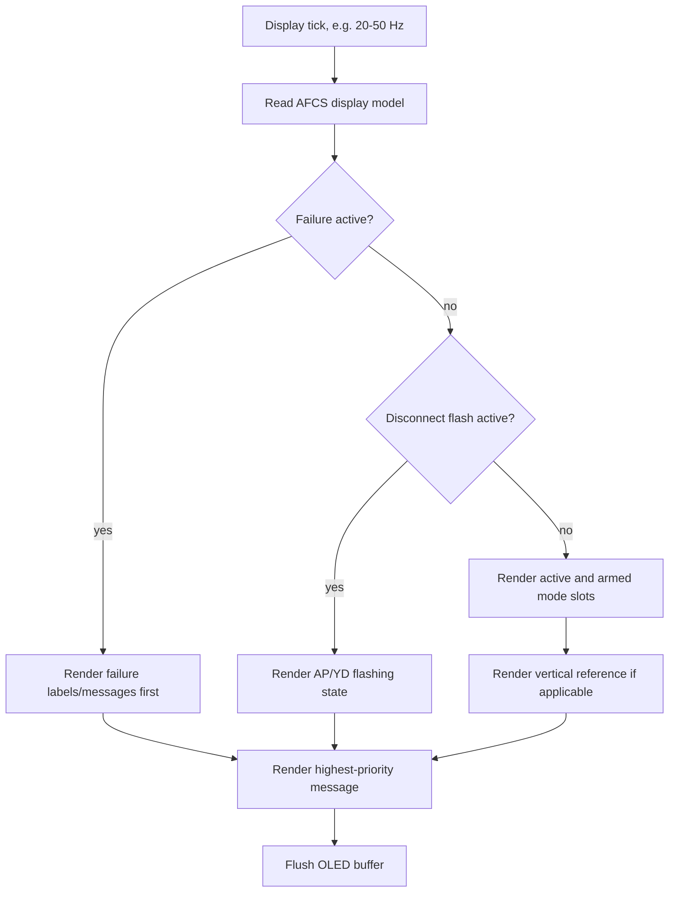
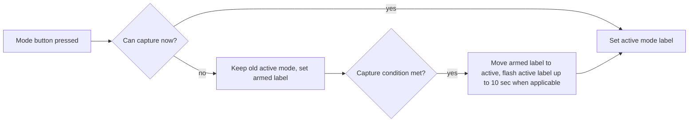

# GFC 600-Style Display Annunciation Workflow

Purpose: define when labels should appear on the ESP32 OLED for a GFC 600-style MSFS panel.

Primary source: Garmin `GFC 600 Automatic Flight Control System (with Color Display) Pilot's Guide`, `190-03090-00 Rev. A`, January 2024.

## Display Layout

Recommended OLED model:

```text
+------------------------------------------------+
| LAT ACTIVE | AP/YD + MSG AREA | VERT ACTIVE    |
| LAT ARMED  | REF / ALERTS     | VERT ARMED     |
+------------------------------------------------+
```

Garmin-style slot mapping:

| Slot | Garmin behavior | OLED project behavior |
|---|---|---|
| Left top | Active lateral mode | Show green/active style label. |
| Left bottom | Armed lateral mode | Show white/armed style label when armed. |
| Center | AP/YD engagement and messages | Show `AP`, `YD`, flash/failure/message states. |
| Right top | Active vertical mode | Show green/active style label. |
| Right bottom | Armed vertical modes | Show `ALTS`, `ALT`, `GP`, `GS`, `VPTH`, etc. |
| Reference area | Vertical reference | Show numeric ref for `ALT`, `VS`, `IAS`, `FLC`. |

If the OLED is monochrome, use visual substitutes:

| Garmin color | Monochrome substitute |
|---|---|
| Green active | steady bright text |
| White armed | steady dim/small text |
| Yellow attention | flashing text or inverse video |
| Red failure | fast flashing inverse video |

## Label Priority

Highest priority wins when display space is limited:

1. Failures: `AP FAIL`, `YD FAIL`, trim fail, red AP/YD.
2. Manual disconnect flash: yellow/flashing `AP` or `YD`.
3. Active coupled modes: `LVL`, `GA`.
4. Active captured modes: `ALT`, `ALTS`, `GP`, `GS`, `GPS`, `LOC`, etc.
5. Armed modes: `ALTS`, `GP`, `GS`, `VPTH`, lateral armed labels.
6. References: altitude, VS, IAS/FLC.
7. Advisory messages: `SET HDG=CRS`, `ESP OFF`, etc.

## Label Trigger Table

| Label | Slot | Present When |
|---|---|---|
| `AP` | center | Autopilot engaged. Flash yellow after manual disconnect. Red/fast flash for AP failure. |
| `YD` | center | Yaw damper engaged. Flash yellow after manual disconnect. Red/fast flash for YD failure. |
| `TRIM` | center/message | Trim failure or mistrim condition. |
| `PFT` | message | Preflight test in progress. |
| `PFT FAIL` | message | Preflight test failed. |
| `ROL` | active lateral | Roll Hold active. Default lateral mode. |
| `HDG` | active lateral | Heading Select active. |
| `GPS` | active or armed lateral | GPS NAV/APR selected, armed, or captured. |
| `VOR` | active or armed lateral | VOR NAV selected, armed, or captured. |
| `VAPP` | active lateral | VOR approach active on GMC-style display. |
| `LOC` | active or armed lateral | Localizer NAV/APR selected, armed, or captured. |
| `BC` | active or armed lateral | Backcourse selected, armed, or captured. |
| `PIT` | active vertical | Pitch Hold active. Default vertical mode. |
| `ALT` | active or armed vertical | Altitude Hold active, or armed from selected altitude capture. Also GI 285 equivalent for `ALTV`. |
| `ALTS` | armed or active vertical | Selected altitude capture armed/active. |
| `VS` | active vertical | Vertical Speed mode active. |
| `IAS` | active vertical | IAS mode active on IAS-key model. |
| `FLC` | active vertical | FLC mode active on FLC-key model. |
| `VPTH` | active or armed vertical | VNAV vertical path armed/captured. |
| `ALTV` | active or armed vertical | VNAV constraint altitude capture. |
| `GP` | active or armed vertical | GPS glidepath armed/captured. |
| `GS` | active or armed vertical | ILS glideslope armed/captured. |
| `LVL` | active lateral and vertical | Level mode active. Cancels other armed/active modes. |
| `GA` | active lateral and vertical | Go Around active. `ALTS` may arm if selected altitude capture is available. |
| `MINSPEED` | message | Underspeed protection active. |
| `MAXSPEED` | message | Overspeed protection active. |
| `ESP OFF` | message | ESP disabled. |
| `SET HDG=CRS` | message | DG installation requires selected heading set to selected course in NAV/APR. For simulator, show only if configured. |
| `TRACK MODE` | message | Reversionary GPS Track mode active in supported configuration. |

## Display Update Workflow



## Active vs Armed Rendering



Capture examples:

- `NAV`/`APR` with CDI less than half scale: immediate active capture.
- `NAV`/`APR` with CDI greater than half scale: armed until intercept/capture.
- `ALTS` active near selected altitude, then `ALT` active within about 50 ft.
- `GP`/`GS` armed on approach, active after glidepath/glideslope capture.

## OLED Implementation Notes

- Keep display state in a struct separate from MSFS communication.
- Avoid rendering directly from button handlers.
- Use short flash timers:
  - mode transition attention: up to about 10 sec where Garmin documents it.
  - manual AP/YD disconnect: about 5 sec.
- If display width is tight, abbreviate references before hiding active modes.
- Never hide active lateral or active vertical mode unless showing a failure page.

