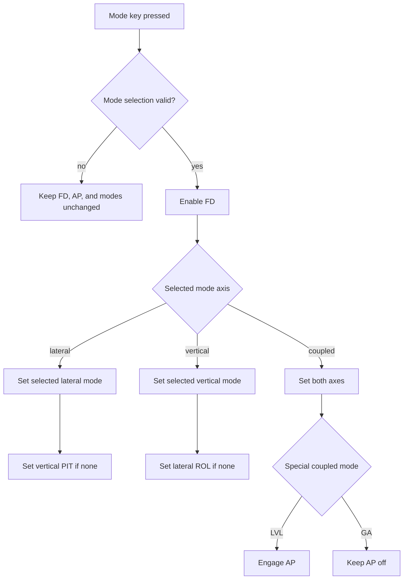
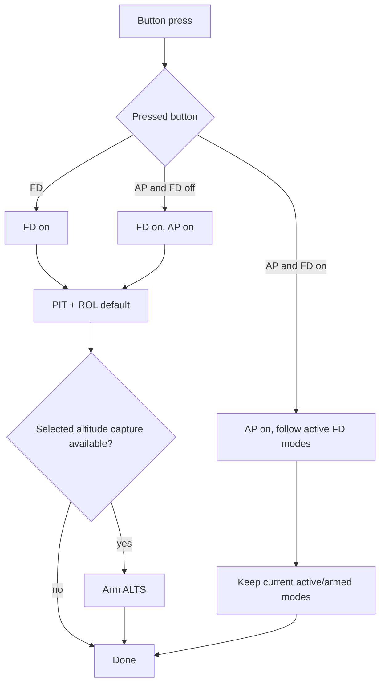
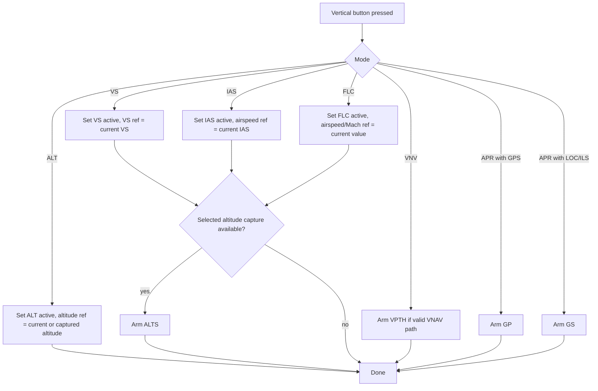
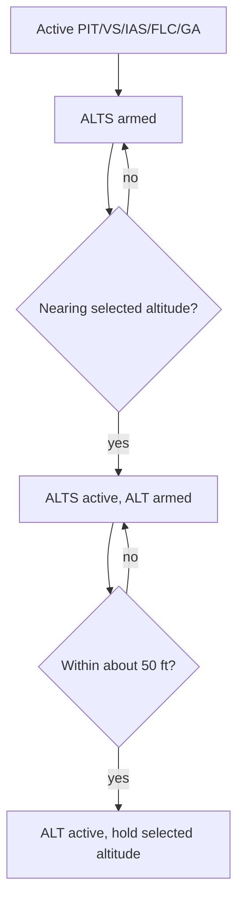
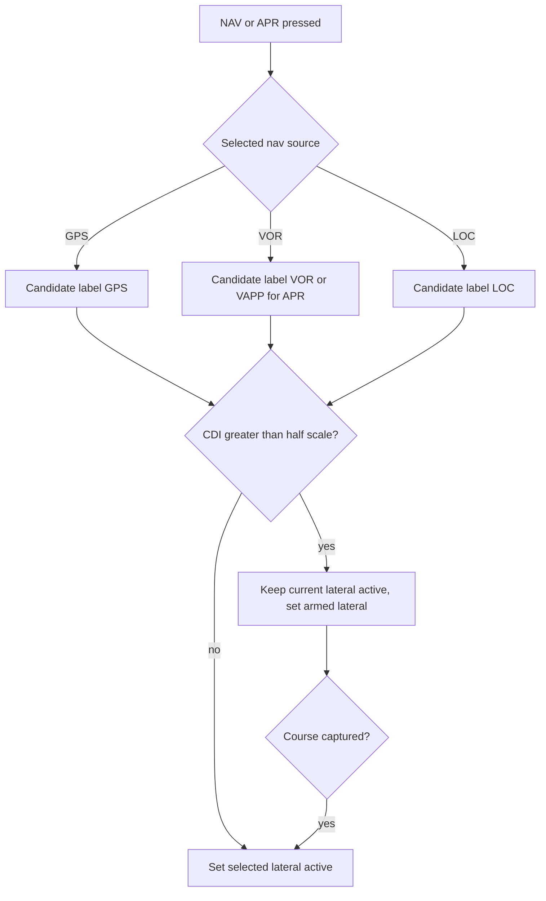
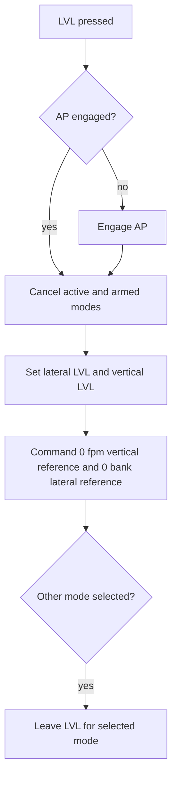
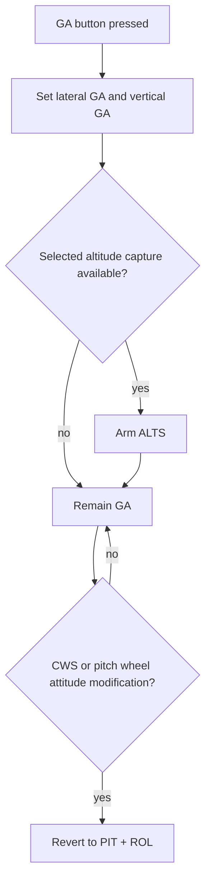
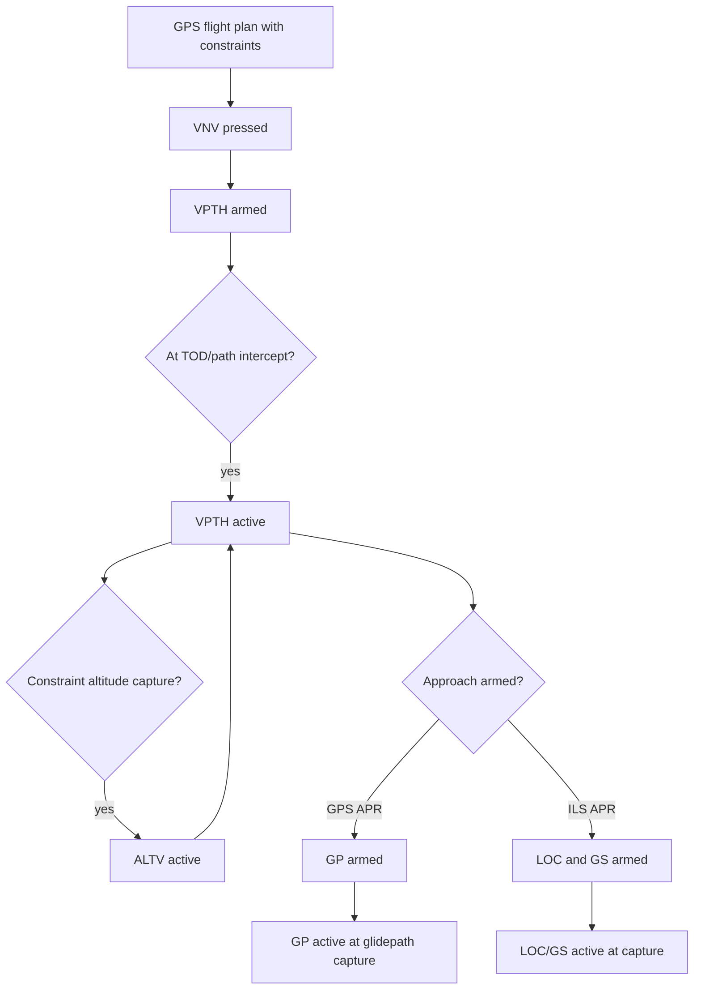

# GFC 600-Style Mode Selection Workflows

This workflow converts Garmin GFC 600 behavior into practical steps for the MSFS/ESP32 panel.

Primary source: Garmin `GFC 600 Automatic Flight Control System (with Color Display) Pilot's Guide`, `190-03090-00 Rev. A`, January 2024.

Detailed FD/AP-off behavior and confidence notes:

- [GFC 600 Mode-Key Behavior With FD And AP Off](../research/gfc600-mode-key-behavior-fd-ap-off.md)

## Workflow 0: Mode Key With FD And AP Off

Project behavior:

- `AP_ON` with `FD_OFF` is not a valid normal state.
- A successful ordinary mode selection while FD is off enables FD, but does not
  engage AP.
- Lateral selections use `PIT` as the default vertical mode.
- Vertical selections use `ROL` as the default lateral mode.
- `LVL` engages AP and selects `LVL` on both axes.
- `GA` selects `GA` on both axes but does not engage AP from an off state.
- Invalid `NAV`, `APR`, `BC`, or `VNV` requests do not change FD, AP, or mode
  state.

## Workflow 1: AP/FD Engagement

Project behavior:

1. On FD from off: active vertical `PIT`, active lateral `ROL`.
2. On AP from FD off: FD on, AP on, active `PIT`/`ROL`.
3. On AP from FD on: AP on, preserve existing modes.
4. If selected-altitude capture exists, arm `ALTS` for compatible vertical modes.
5. Prevent or correct the invalid runtime combination `AP_ON` with `FD_OFF`.

## Workflow 2: Vertical Mode Button

Project behavior:

- `VS`: reference changes in 100 fpm steps.
- `IAS`: reference changes in 1 kt steps.
- `FLC`: reference changes in 1 kt or Mach 0.01 steps depending aircraft.
- `ALT`: reference changes in 10 ft steps. Garmin allows limited adjustment around current altitude; for MSFS mimic, start with +/-200 ft.
- `PIT`: reference changes in 0.5 deg steps.

## Workflow 3: Selected Altitude Capture

Project behavior:

- Use MSFS current altitude, selected altitude, and vertical speed sign to determine closure.
- When `ALTS` becomes active, flash/attention behavior may be applied.
- At approximately 50 ft from target, transition to `ALT`.

## Workflow 4: Lateral NAV/APR Selection

Project behavior:

- `NAV` follows GPS roll steering if available; otherwise course/deviation.
- `APR` is similar but approach-sensitive and can arm vertical `GP` or `GS`.
- VOR approach should show `VAPP` on a GMC-style display. If using GI 285 style, show `VOR`.
- If source changes while NAV/APR is active and autoswitching is not configured, revert lateral active mode to `ROL`.

## Workflow 5: Coupled LVL Mode

Project behavior:

- `LVL` owns both lateral and vertical labels.
- It should clear armed modes.
- It does not track altitude or heading.

## Workflow 6: Coupled GA Mode

Project behavior:

- `GA` owns both lateral and vertical labels.
- Use a configured nose-up pitch reference for the simulated aircraft.
- If the project cannot safely command pitch in MSFS for a chosen aircraft, still display `GA` and send the closest available MSFS TOGA/go-around event.

## Workflow 7: VNAV to Approach

Project behavior:

- Treat VNAV as advanced/phase-2 unless the selected MSFS aircraft exposes usable VNAV state.
- For first implementation, support labels and arming, then validate capture behavior in sim.

