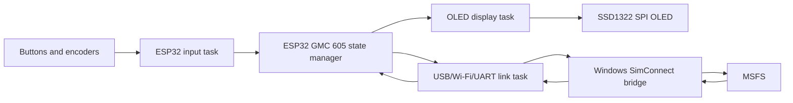
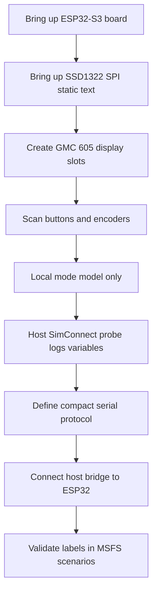
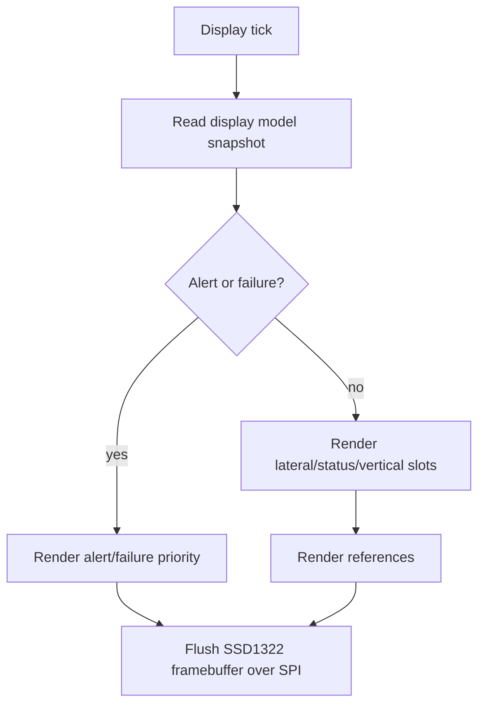
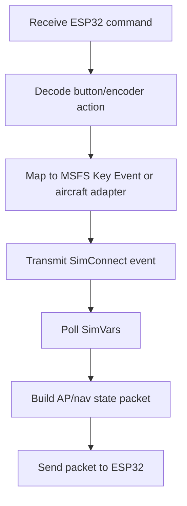

# GMC 605 Hardware To MSFS Architecture Workflow

## Goal

Define the first practical architecture for the GMC 605-style ESP32 panel.

Known decisions:

- Panel style: GMC 605.
- First display: existing SSD1322 SPI OLED.
- Recommended development board: ESP32-S3-DevKitC-1-N8R8.
- MSFS communication: host-side SimConnect bridge, not direct ESP32 SimConnect.

## System Diagram

## ESP32 Task Ownership

| Task / Module | Owns | Notes |
|---|---|---|
| input task | button matrix, encoders, debounce | Emits clean semantic events like `BTN_HDG_PRESS`, `ENC_ALT_PLUS`. |
| state manager | GMC 605 local mode model | Decides display labels and command intent. |
| display task | SSD1322 SPI device and framebuffer | Only task that talks to the OLED. |
| link task | serial/Wi-Fi protocol to host | Sends commands, receives condensed MSFS state. |
| config module | board pins, aircraft profile, display profile | Keeps aircraft-specific logic out of core mode code. |
| test/mock layer | fake MSFS state packets | Enables display and mode tests without MSFS running. |

## First Prototype Workflow

## Display Workflow

## Host Bridge Workflow

## Why This Split Works

- ESP32 stays deterministic: input, display, local states.
- Windows host handles SimConnect and aircraft-specific SDK details.
- You can test the OLED and button logic without MSFS.
- You can test MSFS variables without hardware.
- The project can later support per-aircraft adapters without rewriting firmware.

## First Hardware Pin Planning

Reserve these groups early:

| Function | Pins Needed |
|---|---:|
| SSD1322 SPI | SCLK, MOSI, CS, DC, RESET, optional display power enable |
| Encoders | 2 pins per encoder, plus push pins if used |
| Buttons | direct GPIO or row/column matrix |
| Host link | native USB CDC preferred for development |
| Debug | USB serial/JTAG, one spare GPIO LED |

## Risks To Watch

- SSD1322 module voltage may be 2.8 V logic on bare panels. Breakout boards may include level shifting/regulation; bare FPC panels may not.
- Common color TFTs have better color but worse GMC 605 shape.
- Generic MSFS variables may not expose Garmin-style capture logic cleanly.
- Some MSFS aircraft need custom Input Events or LVars/HVars.

## Recommended Next Step

Lock the first target hardware profile:

- ESP32-S3-DevKitC-1-N8R8.
- Existing SSD1322 SPI OLED.
- USB CDC link to a Windows SimConnect bridge.

Then test display readability before ordering another display.

